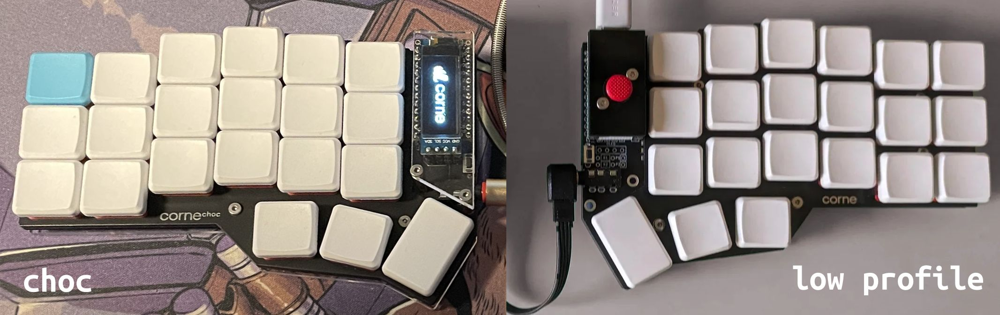

<script setup>
import Images from '../components/Images.vue';

import hardware1 from './hardware-screws.jpg';
import hardware2 from './hardware-gold-spacers.jpg';
import hardware3 from './hardware-silver-spacers.jpg';
</script>

# FAQ

## About

holykeebs is a tiny store operated from Israel. I just like soldering.

holykeebs specializes in ergonomic split keyboards with pointing devices such as trackballs, touchpads and trackpoints.

## Shipping

All orders are shipped from Israel. Please check your country's customs and duties policy to be informed of any potential
fees you might have to pay upon receipt of your order.

### Do you ship globally?

Yes, if you don't see your country in the shipping page, please contact us.

### What shipping methods are available?

Economy methods:

- To the US: items are sent to a fulfillment center in the east coast and then dispatched using USPS or FedEx Ground.
- Rest of the world: items are sent to a fulfillment center in Belgium and then dispatched using Landmark Global. This method uses post office services for the last leg of the delivery.

Express shipping is available using FedEx.

Transit time for economy shipping is around 10-15 days on average, while FedEx is around 5-10 days.

::: tip
Orders shipped using Landmark Global use a secondary tracking number (found on the tracking page, starts with LE) in the destination. This
number can be used in your local postal tracking for more detailed tracking (available after the package arrives to the destination).
:::

### My order's tracking has not been updating!

Orders are sent to a distribution center then shipped to the final destination. The tracking information will not update until the package is scanned at the distribution center, which may take up to 7 days.

In other cases, there could be a customs issue, port issues, parcel / postal system overload, and many more reasons we cannot influence. Please reach out after you have not seen an about for at least a week.

Economy shipping options are delivered on the last leg using the destination country's postal service. The tracking number should show up in your local post office systems and will often have more detailed information (only works once the package arrived at the destination).

## Taxes and Duties

For US customers, shipments made from Israel are taxed at 15% (after the goverment ended the de minimis exemption). We charge this fee from you at checkout, and our shipping partner takes care of paying the customs fee to the authorities.

For other countries: import duties, taxes, and other fees are the responsibility of the customer and are not included. Your local carrier or customs office will notify you upon receiving the shipment if any payment is required.

If you have any questions about how your package was declared, please reach out.

## Warranty and Support

Whether you order a kit or use the build service, we do our best to test everything before shipping. If you discover an issue after unboxing, please reach out and we'll sort it out. For general firmware questions, please use the help-firmware discord channel. Other warranty and support services aren't provided.

We also encourage visiting the larger keyboard communities such as r/ErgoMechKeyboards, r/MechanicalKeyboards, [QMK](https://discord.gg/qmk) / [Low Profile Keyboards](https://discord.gg/j2ekqbkS) discord server.

## Refunds and Returns

### Cancellations

Please contact as soon as possible if you have any problems with your order or wish to cancel.

### Returns

Contact me within: 14 days of delivery.

Ship items back within: 30 days of delivery.

- Buyers are responsible for return shipping costs, **which must have tracking**.
- If the item is not returned in its original condition, the buyer is responsible for any loss in value. This includes any transit damage due to insufficient packaging.
- If your order was sent to you using free shipping, that cost will be deducted from your refund (a minimum of $15).

Please allow up to 7 days from receiving your return for it to be inspected. If approved, you'll be automatically refunded to your original payment method. Otherwise, you'll be contacted by email with further details.

::: info
We have no control over the time it takes for the refunded to be proccessed by your credit card company or bank, please allow up to 10 business days, and contact us in case of issues.
:::

## Wireless

We'd love to do wireless builds but there isn't official support for the pointing devices we use in ZMK. There are various efforts but those aren't confirmed to fully work or be power efficient.

## Low Profile vs. Choc

The difference between these two is the key spacing, i.e. how close the keys are to each other:

1. MX keyboards use a grid of 19x19mm squares. Some keyboards with choc switches also use this, which results in small gaps between keys.
1. Choc spacing uses 18x17mm squares, and produces a more tight arrangement with minimal key spacing. It is specifically designed for Kailh's choc switches (hence the name).

For choc keyboards, we differentiate these two styles of spacing by calling the former Low Profile and the latter Choc.



## Firmware

### Can I Change Split Master

Yes, see [SPLIT_POINTING_ENABLE](https://docs.qmk.fm/#/feature_pointing_device?id=split-keyboard-configuration).

### Remapping Keys

With VIA, keys and layers can be changed without flashing the keyboard. Go to the VIA [web app](https://usevia.app/), or download the [desktop app](https://github.com/the-via/releases/releases). If you don't want to use VIA, please consult QMK docs on how to create your own keymap.

### Trackpoint Calibration

Most trackpoints move the same in all directions, but some may move slower in certain directions. This can be calibrated in firmware by modifying the movement in the misbehaving directions.

This code snippet is a simple solution that bumps the movement for a trackpoint that moves slower in the left and bottom directions. Adjust the multiplier and directions to your need:

```
#define PS2_MOUSE_MULTIPLIER 2

void ps2_mouse_moved_user(report_mouse_t *mouse_report) {
  // Moving left.
  if (mouse_report->x < 0) {
    mouse_report->x *= PS2_MOUSE_MULTIPLIER;
  }
  // Moving down.
  if (mouse_report->y > 0) {
    mouse_report->y *= PS2_MOUSE_MULTIPLIER;
  }
}
```

If this doesn't solve your problem, reach out.

## Hardware: Fasteners, Spacers

All of our keyboards use these screws and spacers.

- Flat head M2 H1.3 hex screws (5mm bottom side, 3mm top side).
- M2 gold spacers (4mm low profile keyboards, 7mm MX keyboards).
- M2 black/silver spacers for OLED (11mm for low profile sockets, 13mm for machine sockets).

<Images :paths="[hardware1, hardware2, hardware3]" />

These are common on Aliexpress in case you need to get additional ones (but feel free to reach out if you'd like us to send you some). You may try these links but they're not guaranteed to stay up or be the most affordable option ([screws](https://www.aliexpress.com/item/1005005267980793.html), [gold spacers](https://www.aliexpress.com/item/1005004564012666.html), [silver spacers](https://www.aliexpress.com/item/1005004416481151.html))
