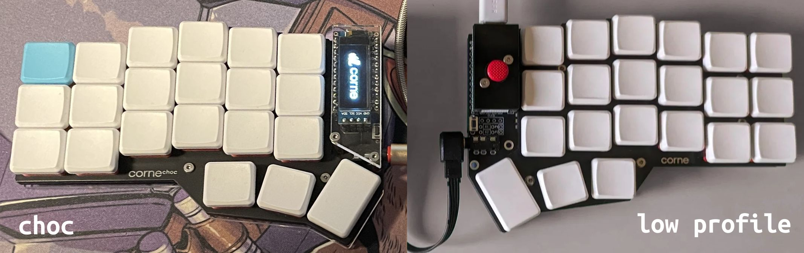

# FAQ

## About

holykeebs is a tiny store operated from Israel. I just like soldering.

holykeebs specializes in ergonomic split keyboards with pointing devices such as trackballs, touchpads and trackpoints.

## Shipping, Taxes and Delivery

### Do you ship globally?

Yes. If you don't see your country on the shipping page, please contact us.

### Where do orders ship from?

All orders are shipped from Israel.

### What shipping methods are available?

Economy methods:

- To the US: items are sent to a fulfillment center on the East Coast and then dispatched using USPS.
- Rest of the world: items are sent to a fulfillment center in Belgium and then dispatched using Landmark Global. This method uses local postal services for the final leg of delivery.

Express shipping is available using FedEx.

Transit time for economy shipping is around 10-15 days on average, while FedEx is around 5-10 days.

::: tip
Orders shipped using Landmark Global use a secondary tracking number (found on the tracking page, starts with LE). This
number can be used in your local postal tracking for more detailed tracking (available after the package arrives in the destination country).
:::

### Taxes, duties, and customs fees

For US customers, import tax is charged at checkout, and our shipping partner handles payment to the relevant authorities.

For all other countries, import duties, taxes, VAT/GST, brokerage fees, or other customs-related charges may apply. These fees are set by the destination country and are not included in our product or shipping prices unless clearly shown at checkout.

Paying any customs fees charged after shipment is the customer's responsibility. Your local carrier or customs office may contact you directly for payment before delivery - it is your responsibility to track the shipment and respond promptly to any requests, otherwise the package may be returned to us or destroyed by customs.

::: info
We are required to declare the correct value and contents of each order on customs forms. We cannot mark orders as gifts or lower the declared value.
:::

### My tracking has not been updating

Orders are first sent to a fulfillment center and then shipped to the final destination. Tracking may not update until the package is scanned at the fulfillment center, which can take up to 7 days.

After that, delays can happen because of customs, local postal issues, port delays, or other issues outside our control. For economy shipping, the final delivery is handled by the destination country's postal service, and the local tracking number may show more detailed updates once the package arrives in the destination country.

Please contact us if tracking has not updated for at least a week.

### If a package is returned, refused, or held by customs

If a package is returned to holykeebs because customs fees were not paid, the package was refused, or the shipping address was incomplete or incorrect, we may be able to reship it once it is returned to us.

The customer is responsible for reshipping costs. Original shipping fees are non-refundable, and any return-to-sender fees charged to us may be passed on to the customer.

If the package is returned and you do not want it reshipped, refunds are handled case by case. Please reach out to us.

## Cancellations, Returns and Refunds

### Cancellations

Please contact us as soon as possible if you need to cancel or change your order.

If the order has not shipped yet, we'll do our best to help. Once an order has shipped, it can no longer be cancelled.

### Returns after delivery

Contact us within 14 days of delivery if you would like to return an item.

Items must be shipped back within 30 days of delivery.

Buyers are responsible for return shipping costs, and the return shipment must include tracking.

If the item is not returned in its original condition, the buyer is responsible for any loss in value. This includes transit damage caused by insufficient packaging.

### Refunds

Once we receive your return, please allow up to 7 days for it to be inspected. If approved, the refund will be sent to your original payment method.

The following amounts are not refunded:

- If your order was sent using free shipping, the original shipping cost is deducted from your refund (minimum deduction of $15).
- For US customers, import tax collected at checkout is non-refundable.

Once the refund is issued, your bank or credit card company may take additional time to process it. Please allow up to 10 business days, and contact us if there are any issues.

For packages returned to us by the carrier (refused, held by customs, or undeliverable), see [If a package is returned, refused, or held by customs](#if-a-package-is-returned-refused-or-held-by-customs).

## Warranty and Support

Whether you order a kit or use the build service, we do our best to test everything before shipping. If you discover an issue after unboxing, please reach out and we'll sort it out. For general firmware questions, please use the help-firmware discord channel. Other warranty and support services aren't provided.

We also encourage visiting the larger keyboard communities such as r/ErgoMechKeyboards, r/MechanicalKeyboards, [QMK](https://discord.gg/qmk) / [Low Profile Keyboards](https://discord.gg/j2ekqbkS) discord server.

## Wireless

We'd love to do wireless builds but there isn't official support for the pointing devices we use in ZMK. There are various efforts but those aren't confirmed to fully work or be power efficient.

## Low Profile vs. Choc

The difference between these two is the key spacing, i.e. how close the keys are to each other:

1. MX keyboards use a grid of 19x19mm squares. Some keyboards with choc switches also use this, which results in small gaps between keys.
1. Choc spacing uses 18x17mm squares, and produces a more tight arrangement with minimal key spacing. It is specifically designed for Kailh's choc switches (hence the name).

For choc keyboards, we differentiate these two styles of spacing by calling the former Low Profile and the latter Choc.

## Firmware

### Can I change split master?

Yes, see [SPLIT_POINTING_ENABLE](https://docs.qmk.fm/#/feature_pointing_device?id=split-keyboard-configuration).

### Remapping keys

With VIA, keys and layers can be changed without flashing the keyboard. Go to the VIA [web app](https://usevia.app/), or download the [desktop app](https://github.com/the-via/releases/releases). If you don't want to use VIA, please consult QMK docs on how to create your own keymap.

## Hardware: Fasteners, Spacers

All of our keyboards use these screws and spacers.

- Flat head M2 H1.3 hex screws (5mm bottom side, 3mm top side).
- M2 gold/silver spacers (4mm low profile keyboards, 7mm MX keyboards).
- M2 black/silver spacers for OLED (11mm for low profile sockets, 13mm for machine sockets).

<Images :paths="[hardware1, hardware2, hardware3]" />

These are common on Aliexpress in case you need to get additional ones (but feel free to reach out if you'd like us to send you some). You may try these links but they're not guaranteed to stay up or be the most affordable option ([screws](https://www.aliexpress.com/item/1005005267980793.html), [gold spacers](https://www.aliexpress.com/item/1005004564012666.html), [silver spacers](https://www.aliexpress.com/item/1005004416481151.html))
