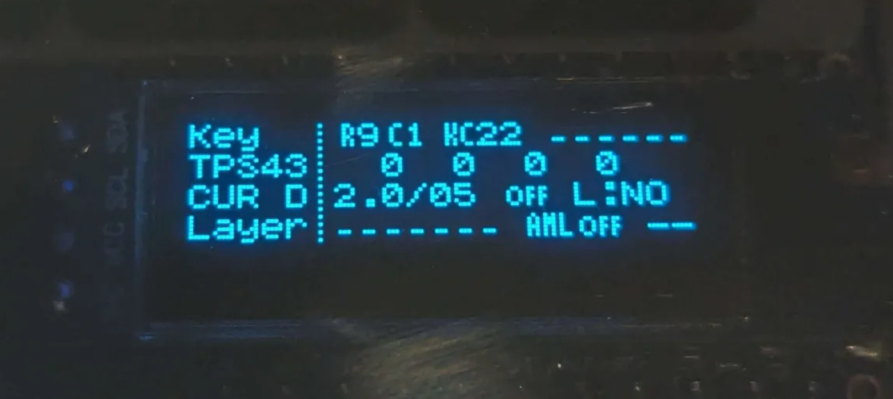

<script setup>
import NameGenerator from './NameGenerator.vue'
</script>

<head>
<link rel="stylesheet" href="https://cdn.jsdelivr.net/npm/bulma@1.0.2/css/versions/bulma-prefixed.min.css">
</head>

# Firmware

[QMK](https://docs.qmk.fm/#/) is a popular free and open-source keyboard firmware. All of our keyboards are supported by QMK and VIA / Remap for dynamic key assignments and layering. The firmware provides features that streamline pointing device usage, which is a focus of the store. These include:

- scaled movement: transforms the x/y that's read from the pointing device. This is useful for large screens or cases where fine grained move is necessary. Supports two modes: default and "sniping", each with its own multiplier.
- drag scroll mode: convert mouse moves into scrolling (similar to middle mouse click).
- buffered scroll: slows down scrolling for more control.
- scroll lock: constraints scrolling to vertical / horizontal only.

All of the above can be adjusted on the fly without flashing a new firmware. See [below](#features) for a more in-depth walkthrough.

::: details Keyball/Killer Whale
These keyboards have a firmware specific to them with similar features as above.
:::

::: info
Fully built keyboards already come flashed and tested. You can use these instructions to learn how to flash your own keymap / custom logic onto the standard firmware we provide.
:::

::: danger
Avoid connecting / disconnecting the TRRS cable when the keyboard is powered. This can short the GPIO pins of the controllers.
:::

## Source Code

The source code for all keyboards can be found on the `hk-master` branch of https://github.com/holykeebs/qmk_firmware. This repo is periodically kept up to date with main QMK.

To gain access to the repository, please use this [form](http://holykeebs.com/github-access).

::: details Why is this necessary?

Sometime in 2024, DIY keyboards have started to hit Aliexpress. While this have had some positive effects on our niche little hobby, it has also brought less nice things, one of which is misuse of source code. An example of this is using a firmware - that we've worked hard on developing, testing and keeping up to date with QMK - with the keyboards that are sold on Aliexpress. In and of itself this wouldn't be an issue, but what reality shows is that these stores do not provide any customer support and their customers end up seeking help with us.

In an attempt to limit this from happening, the source code is now invite only. If you're a customer or a diy'er with no commercial intentions, you're welcome to request access and use it.

:::

Most of the custom logic is contained to `users/holykeebs` and the specific keyboard you're flashing for. Some scaffolding changes were also required in core QMK, but these are quite limited.

If you wish to bring the changes into your own fork of QMK, please make sure you've copied them all. The diff can be obtained as follows:

```shell
$ git remote add holykeebs https://github.com/holykeebs/qmk_firmware
$ git diff holykeebs/master...holykeebs/hk-master
```

## Precompiled

Precompiled firmwares for all possible configurations are available [here](https://github.com/holykeebs/qmk_compiled/releases/tag/latest). Each file is named according to its configuration. Change the selection below to match your keyboard:

<NameGenerator />

Entering the bootloader:

- On a Sea Picro, press the reset button for ~1 second.
- On an RP2040 Pro Micro, there are two buttons on the components side of the controller: hold the BOOT button and then press the RESET button next to it. If your controller is already flashed with a QMK firmware, you can simply double tap the reset button on the keyboard itself.

The [commands.txt](https://github.com/holykeebs/qmk_compiled/releases/download/latest/commands.txt) has a list of file name to the make command that produced it and can be used as a reference.

::: danger
Avoid connecting / disconnecting the TRRS cable when the keyboard is powered. This can short the GPIO pins of the controllers.
:::

## Compiling

Since many of our keyboards share common features such as OLED / Pointing Devices, these are supported via the [Userspace feature](https://docs.qmk.fm/#/feature_userspace): this allows the logic to be separated from a specific keyboard / keymap. See the files in [`users/holykeebs`](https://github.com/holykeebs/qmk_firmware/tree/hk-master/users/holykeebs).

Start by setting up a development environment per [QMK instructions](https://docs.qmk.fm/#/newbs). Clone the repo above and not the main QMK repo:

```shell
# It's also possible to use qmk setup instead of git clone: qmk setup holykeebs/qmk_firmware
$ git clone --recurse-submodules https://github.com/holykeebs/qmk_firmware -b hk-master
$ cd qmk_firmware
```

### Building

The basic structure of the build and flash command is:

```shell
make <keyboard>:via[:flash] -e USER_NAME=holykeebs [-e feature1=value1]...
```

The value for `<keyboard>` should match the keyboard you are flashing for:

| Keyboard  | Value |
| --------- | ----------------- |
| Corne     | crkbd/rev1        |
| Lily58    | lily58/rev1       |
| Sweep     | holykeebs/sweeq   |
| Span      | holykeebs/spankbd |
| Keyball39 | keyball/keyball39 |
| Keyball44 | keyball/keyball44 |
| Keyball61 | keyball/keyball61 |

::: info
For Keyball, please see the [dedicated section](#keyball) as the options below don't apply.
:::

The table below lists the possible flags that control what feature to turn on in the firmware.

| Flag          | Description |
| ------------- | ----------- |
| `-e POINTING_DEVICE=tps43`<br>         ` trackpoint`<br>         ` trackball`<br>         ` cirque35`<br>         ` cirque40` | enable pointing device |
| `-e POINTING_DEVICE_POSITION=left`<br>      `right`<br>      `thumb_inner`<br>      `thumb_outer`<br>      `middle` | specify pointing device position |
| `-e OLED=yes` | enable OLED screen |
| `-e TRACKBALL_RGB_RAINBOW=yes` | enable a rainbow color animation on the trackball LED |

An example command might look like this:

```shell
make \
    crkbd/rev1:via:flash \
    -e USER_NAME=holykeebs \
    -e POINTING_DEVICE=trackball \
    -e POINTING_DEVICE_POSITION=right \
    -e TRACKBALL_RGB_RAINBOW=yes \
    -e OLED=yes \
    -j8
```

Breaking this down:

1. `crkbd/rev1:via:flash` flashes for a Corne with VIA. Omitting `:flash` would just build the firmware without flashing.
1. `-e USER_NAME=holykeebs` to also pull code from `users/holykeebs`.
1. `-e POINTING_DEVICE=trackball` configures the trackball.
1. `-e POINTING_DEVICE_POSITION=right` configures the trackball to the right side of a split keyboard.
1. `-e TRACKBALL_RGB_RAINBOW=yes` configures the rainbow effect on the trackball.
1. `-e OLED=yes` enables the OLED.
1. `-j8` parallizes the build process.

::: details gcc error

If the make command fails with `gcc: error: unrecognized command-line option ‘-mthumb’`, you can try this alternative command:
```shell
qmk flash \
    -e USER_NAME=holykeebs \
    -e POINTING_DEVICE=trackball \
    -e POINTING_DEVICE_POSITION=right \
    -e TRACKBALL_RGB_RAINBOW=yes \
    -e OLED=yes -j8 \
    -kb crkbd/rev1 -km via
```

:::

### Flashing

Run the command you built in the previous step, with `:flash` after the keymap name to also flash after building.

If the command succeeded, you should be seeing this at the end:

```shell

 _           _       _             _
| |__   ___ | |_   _| | _____  ___| |__  ___
| '_ \ / _ \| | | | | |/ / _ \/ _ \ '_ \/ __|
| | | | (_) | | |_| |   <  __/  __/ |_) \__ \
|_| |_|\___/|_|\__, |_|\_\___|\___|_.__/|___/
               |___/

Pointing Device: trackball
OLED: yes
Keyboard main side: right

WARNING! Avoid connecting / disconnecting the TRRS cable when the keyboard is powered. This can short the GPIO pins of the controllers.

Flashing for bootloader: rp2040
Waiting for drive to deploy...
```

::: tip
Make note of the `Flashing for bootloader` line: if you're not seeing this at the end of the output, you are not on the correct branch.
:::

Connect the controller to the computer. Sometimes it will go into bootloader if it hasn't been flashed before.

If not, enter bootloader manually:

- On a Sea Picro, press the reset button for ~1 second.
- On an RP2040 Pro Micro, there are two buttons on the components side of the controller: hold the BOOT button and then press the RESET button next to it. If your controller is already flashed with a QMK firmware, you can simply double tap the reset button on the keyboard itself.

On split keyboards, repeat the flashing process for the other controller.

::: danger
Avoid connecting / disconnecting the TRRS cable when the keyboard is powered. This can short the GPIO pins of the controllers.
:::

### Dual Pointing Devices

When using multiple pointing devices, the pointing device specification turns to `-e POINTING_DEVICE=<left>_<right>` where left and right take one of `tps43`, `trackball`, `trackpoint`, `cirque40` or `cirque35`. The `-e POINTING_DEVICE_POSITION` flag can be omitted since it's implied by the pointing device configuration.

Additionally, we now need to specify the side we're flashing with `-e SIDE=right` or `-e SIDE=left` because we need a different firmware to be flashed on each side.

Example:

```shell
make \
    crkbd/rev1:via:flash \
    -e USER_NAME=holykeebs \
    -e POINTING_DEVICE=trackball_trackpoint \
    -e SIDE=right \
    -j8
```

The example above flashes the right side, which should be the side with the trackpoint (since it appears on the right of `POINTING_DEVICE`).

The left side would be flashed as follows:

```shell
make \
    crkbd/rev1:via:flash \
    -e USER_NAME=holykeebs \
    -e POINTING_DEVICE=trackball_trackpoint \
    -e TRACKBALL_RGB_RAINBOW=yes \
    -e SIDE=left \
    -j8
```

### Keyball

The Keyball firmware lives [here](https://github.com/holykeebs/qmk_firmware/tree/hk-master/keyboards/keyball). It uses a different set of custom keycodes than mentioned before, but the general usage is similar.

::: details
The "official" Keyball firmware is maintained in a dedicated repository by the designer of the keyboard and is written for Pro Micro controllers. It rewrites some of the functionality that nowadays exists in QMK, and disables a number of features to save space on the low memory Pro Micro controllers.

We've modernized the firmware by supporting RP2040 controllers, and making use of as much standard QMK code as possible, such as the native PMW3360 driver, split pointing and more. The net result is an easier to maintain firmware with less bugs.
:::

::: danger
Avoid connecting / disconnecting the TRRS cable when the keyboard is powered. This can short the GPIO pins of the controllers.
:::

While on the `hk-master` branch, flash both sides using:

```shell
# Replace 44 with the Keyball you have (39, 44 or 61).
make keyball/keyball44:via:flash -j8
```

USB cable can be connected to either side of the keyboard.

## Testing

1. On a split keyboard, connect the halves when none of the sides are powered.
1. On a split keyboard, the output of the build/flash command will say which side needs to be connected to the computer.
1. On first use, a dialog from the OS may open to configure a new keyboard, go through that.
1. Use VIA's test matrix tab (Remap has a similar dialog) to check all of the keys work.

If one of the keys do not work, head over to [Troubleshooting](/troubleshooting/).

## Features

::: info
The Keyball and Killer Whale firmwares have their own dedicated implementation that overlaps with the functionality described below. Please refer to their respective documentation for more details.
:::

The default firmware facilitates pointing device usage by extending QMK with some useful and common functionality. This functionality is exposed via a collection of keycodes that can be bound to your liking. The `hk` keymap provides a batteries included mapping in a dedicated `POINTER` layer to make use of these keycodes.

### Scaling

Often the stock movement speed of the pointing device isn't a good fit for your setup. This allows scaling the output of the movement before its sent to the host.

Scaling is supported on a default profile and a secondary, "sniping" profile.

::: details
The current implementation intentionally doesn't alter the related CPI/DPI setting as this doesn't work well with all pointing devices (e.g. on a touchpad where a lot of different settings are derived from the CPI and cease to function properly).
:::

### Sniping

Sniping is simply another scale profile that can be applied to a pointing device, either by holding a key or toggling the mode. It's called sniping because this mode usually uses a smaller scale than the default profile, thus allowing finer movement.

### Drag Scroll

Drag scroll lets you move a pointing device and have those moves translate to scrolls, figuratively dragging the mouse to scroll.

### Buffered Scroll

Moving the mouse to scroll often results in an unusable scroll amount. This buffers a specified amount of move before sending a scroll to the host, effectively slowing it down.

### Scroll Lock

Locks scrolling to the horizontal or vertical axis.

### OLED

On a keyboard with a pointing device and screen, the screen will display the following information:



| Row | Description                                                                                     |
|:----|:------------------------------------------------------------------------------------------------|
|  0  | Displays information on the last pressed key, and any held ones                                 |
|  1  | Displays the current pointing device (or NONE) and the last x/y/v/h movements                   |
|  2  | On the left, displays the current pointing profile (D for default, S for sniping)               |
|  2  | On the right, displays the scaling multpilier, scroll buffer, drag scroll mode, and scroll lock |
|  3  | Displays the active layers and whether automatic mouse layer is on                              |

### Usage

The following keycodes allow control of the above features. Orders that use the build service and have a pointing device come flashed with a default firmware that already puts these keys at sane locations. See [keymaps](../keymaps/index.md) for more details.

| Keycode        | Value on Remap  | VIA code | Description                                                                 |
|:---------------|:----------------|:---------|:----------------------------------------------------------------------------|
| `HK_RESET`     | `Kb 0`          | `0x7e00` | Resets the configuration to its default state                               |
| `HK_SAVE`      | `Kb 1`          | `0x7e01` | Saves the current config, making it persist across keyboard restart         |
| `HK_DUMP`      | `Kb 2`          | `0x7e02` | Dumps the current config to the console (needs `CONSOLE_ENABLE=yes`)        |
| `HK_P_SET_D`   | `Kb 3`          | `0x7e03` | When held*, tapping up/down increases/decreases the default profile's scale |
| `HK_P_SET_S`   | `Kb 4`          | `0x7e04` | When held*, tapping up/down increases/decreases the sniping profile's scale |
| `HK_P_SET_BUF` | `Kb 5`          | `0x7e05` | When held*, pressing up/down increases/decreases the scroll buffer          |
| `HK_S_MODE`    | `Kb 6`          | `0x7e06` | When held*, enables sniping                                                 |
| `HK_S_MODE_T`  | `Kb 7`          | `0x7e07` | Toggles sniping                                                             |
| `HK_D_MODE`    | `Kb 8`          | `0x7e08` | When held*, enables the drag scroll                                         |
| `HK_D_MODE_T`  | `Kb 9`          | `0x7e09` | Toggles drag scroll                                                         |
| `HK_C_SCROLL`  | `Kb 10`         | `0x7e0a` | Cycles the scroll lock between off, horizontal and vertical                 |

\* Holding shift while using any of the config keycodes that need to be held will affect the peripheral pointing device.

### Debugging

Without an OLED, it's impossible to know what the values above are set to. If you'd like to tune them or just see what's going
on behind the scenes, you can turn on debug mode.

When compiling your own firmware, simply set `CONSOLE_ENABLED=yes` in `users/holykeebs/rules.mk` or in any other `rules.mk` in your
keyboard tree.

When using the precompiled firmwares, debug mode is turned on if the file begins with `debug_`.

Once debug mode is turned on, run `qmk console` with the keyboard plugged in. Example output when tapping the `HK_DUMP` key:

```shell
liliums:Lily58:1: keyboard_post_init_user: reading eeprom, check: 1
liliums:Lily58:1: init_state
liliums:Lily58:1: debug_hk: state = {
liliums:Lily58:1:       is_main_side=1
liliums:Lily58:1:       setting_default_scale=0
liliums:Lily58:1:       setting_sniping_scale=0
liliums:Lily58:1:       setting_scroll_buffer=0
liliums:Lily58:1:       main=
liliums:Lily58:1:       {
liliums:Lily58:1:               pointer_kind=trackpoint
liliums:Lily58:1:               cursor_mode=default
liliums:Lily58:1:               drag_scroll=0
liliums:Lily58:1:               scroll_lock=off
liliums:Lily58:1:               pointer_default_multiplier=2.00
liliums:Lily58:1:               pointer_sniping_multiplier=1.00
liliums:Lily58:1:               pointer_scroll_buffer_size=5
liliums:Lily58:1:       }
liliums:Lily58:1:       peripheral=
liliums:Lily58:1:       {
liliums:Lily58:1:               pointer_kind=tps43
liliums:Lily58:1:               cursor_mode=default
liliums:Lily58:1:               drag_scroll=0
liliums:Lily58:1:               scroll_lock=off
liliums:Lily58:1:               pointer_default_multiplier=1.50
liliums:Lily58:1:               pointer_sniping_multiplier=1.00
liliums:Lily58:1:               pointer_scroll_buffer_size=5
liliums:Lily58:1:       }
liliums:Lily58:1: }
```

## Patterns

### Permanent Scroll

On a dual pointing device setup, it's often desirable to set one of the pointing devices to always scroll (this is done by default if the secondary one is a Pimoroni Trackball).

To do this, hold shift and tap `HK_D_MODE_T`. This will toggle drag scroll on the peripheral pointing device. Test if the scroll speed is comfortable, and if not adjust it by setting the scale/scroll buffer.

Finish by pressing `HK_SAVE` to persist the changes.

## Community Keymaps

This section is dedicated to keymaps written by community members, describing the special aspects that were implemented:

[@R4_Unit's firmware](https://github.com/Koloth/qmk_firmware/tree/master/keyboards/crkbd/keymaps/Koloth): 4 layers accessed through a pair of thumb keys. The trackball is different on each layer.

::: details
Layer 0: Trackball scrolls the page.  For me, my most common mouse action was scrolling in a web browser etc, so this is the default.  Works perfectly for this task.

Layer 1: Trackball presses arrow keys.  I also really like this for moving inside text fields and it feels really good with the clicks of the trackball.  This is how it was used on older mobile phones, and it is really good at this.

Layer 2: Trackball is mouse.  Out of the box, the pimoroni is a pretty bad mouse, needing you to drag it edge-to-edge about 5 times to move across your screen. If you just up the sensitivity then it isn’t accurate enough to do things like select individual buttons. I’ve added nonlinear response to mine, so that moving it twice as fast doesn’t just move it twice as far, but actually 4x as far (3x as fast, 9x as far, etc.). This gives you the best of both worlds, and if you use like a Mac trackpad, you are already used to this behavior.

Layer 3: Trackball is app switcher.  Again this feels nice as a slightly better version of alt-tab.

I also have a variety of dedicated shortcut keys for things like: screenshot, switch tabs in a browser, basic window arrangement (left-half, right-half, etc.)
:::
