

# Keyboard Build Guide

Congratulations on your decision to try out an ergonomic, low profile keyboard!

All of our keyboards share some common features:

- Designed for Kailh choc v1 switches.
- Allows either soldering the switches or using hotswap sockets.
- Face down microcontrollers.
- Black PCBs, non reversible: I prefer the cleaner look of the top side and generally think it's easier to deal with.
- 1.2 mm top plates.
- Powered by QMK.

If you find these instructions lacking, please check [Additional Resources](#additional-resources).

## Getting Started

This guide will walk you through building and flashing a keyboard from start to finish. Even though this guide might seem long, don't let that deter you: building a keyboard is an extremely fun and rewarding project.

Depending on how you configured your purchase, some of the steps may have been done for you and can be skipped.

In a from scratch kit, you will find components (diodes, sockets, switches), PCBs, and hardware (screws, spacers).

Here's an example PCB of a Corne Choc:

<Images :paths="[pcbstop, pcbsbottom]" />

As you can see, the top side is fairly neat. We will solder things only on the bottom side.

## Tools

To fully build a keyboard, you will need these tools at a minimum:

- Soldering iron + solder.
- Tweezers (to pick up the diodes / hotswap sockets).
- Flush cutters (if cutting pins is necessary).
- M2 hex screwdriver for attaching a case.

Consult [Recommended Tools](../../recommended-tools/) if you plan on purchasing some of these.

## Diodes

We will start with the smallest components we have to deal with in this guide. SMD components can be intimidating if you've never dealt with them before, but once you get the hang of it, they should go fairly smoothly.

Add a dab of solder to the top side of the diode pads.

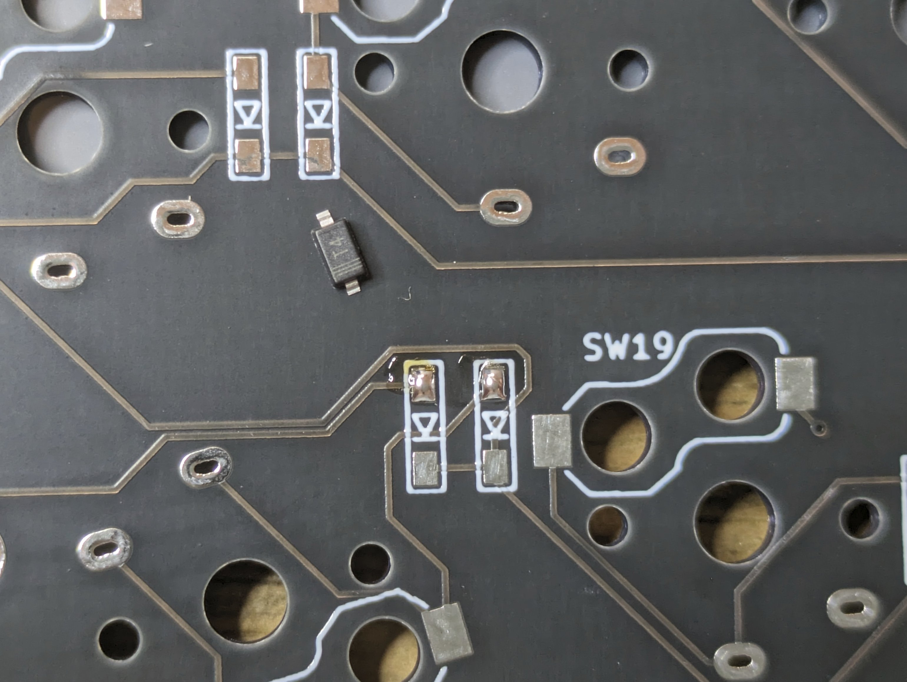

Diodes need to be oriented such that the line on the diode is on the same side as the line on the PCB.

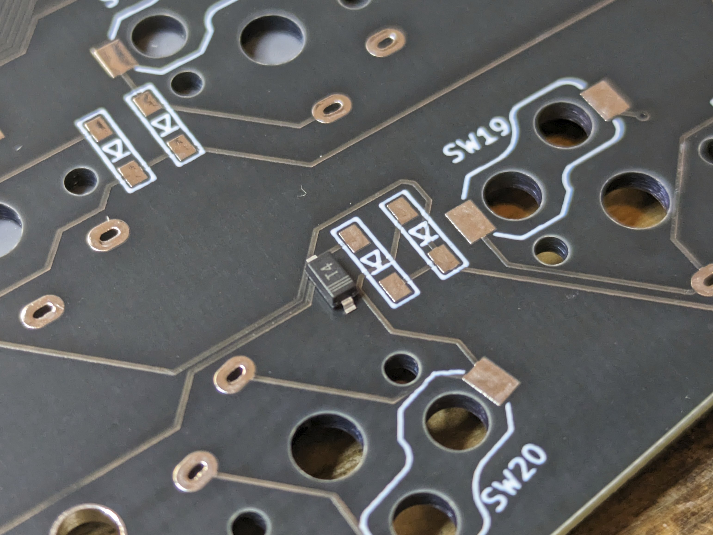

Hold a diode with a pair of tweezers in one hand, and push it into the pad with the soldering iron on the pad with your other hand so the solder is molten. Once positioned, move the iron so the solder is no longer molten, and only then move the tweezers.

<Images :paths="[diodesonelegsoldered1, diodesonelegsoldered2]" />

Repeat this for all diodes. Pick up the board and jiggle it lightly to make sure all diodes are actually held to the pad.

Add solder to the bottom pads.

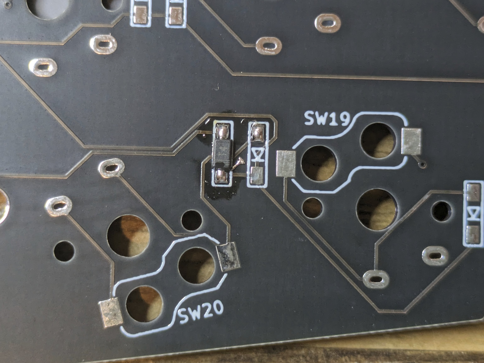

## Hotswap Sockets

::: info
Skip this step if you didn't get hotswap sockets.
:::

Find the hotswap sockets in your kit, follow these [instructions](https://github.com/foostan/crkbd/blob/main/corne-chocolate/doc/buildguide_en.md#kailh-pcb-socket).

## Controllers

### Sockets

It's important for the controller sockets to be properly aligned to the PCB so the controller can be inserted and removed easily, and for the pointing device to be seated right. It can be a bit of a challenge to do this so take your time.

#### Option 1

::: info
This is less beginner friendly but usually produces the best result.
:::

Start by pushing the sockets into the top side PCB. With the sockets still in place, flip the PCB over onto a flat surface.

While pressing down on the PCB so the sockets have no play, add solder to the first and last pins, securing the sockets. Be careful not to touch your finger with the iron.

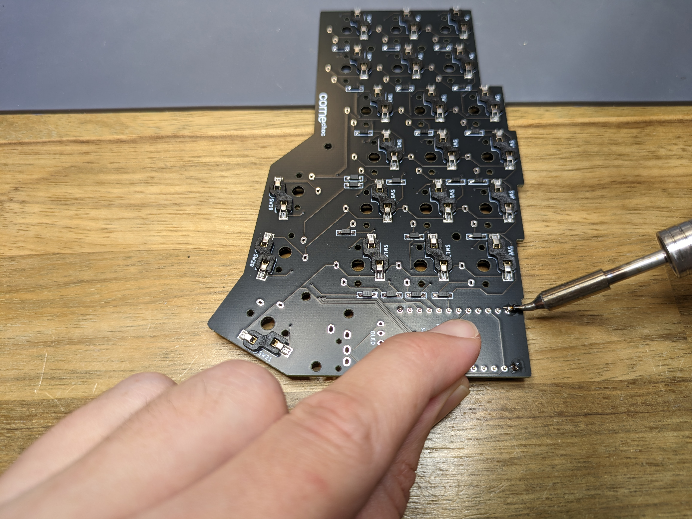

Look at the sockets from the other side, check they are positioned correctly.

<Images :paths="[controllersocketscheck1, controllersocketscheck2]" />

Finish soldering the rest of the pins.

#### Option 2

1. Take a piece of tape to hold the sockets in place.
1. Solder the first and last pins on each row.
1. Look at the sockets from the other side, check they are positioned correctly.
1. Finish soldering the remaining pins.

### Headers

Machine headers have an orientation and should be pushed correctly for best fit. One side is flat, the other has a small bevel to it:

<Images :paths="[controllerheaders1, controllerheaders2]" />

The flat side should be at the top when pushing the headers into the sockets:

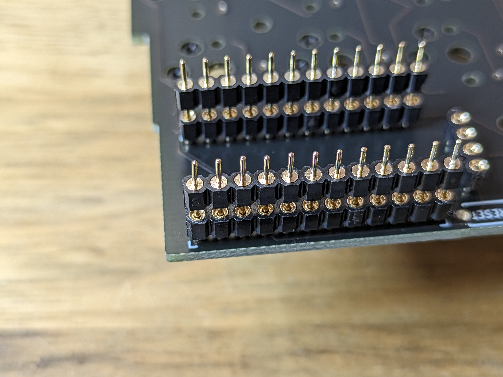

Push the headers all the way so there's no gap between the headers and sockets. If the headers don't go in easily, check that there are no bent pins.

Put a controller on the headers (face down), check that it's flush with the black plastic.

<Images :paths="[controllerheadersflat, controllerheadersnotflat]" />

Solder the first and last pins on each row, check that the controller is still straight. Finish soldering the remaining pins.

::: tip
The best result is achieved when building a small and consistent solder cone on each pin. This ensures the joint is reliable and helps with leveling the pointing device so it sits straight on top of the controller.

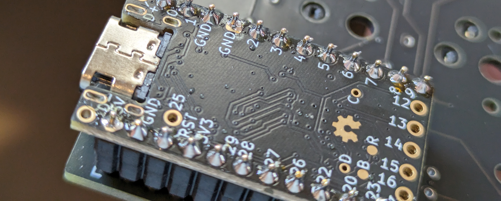
:::

#### Mill-max

The process is largely similar for Mill-max pins, do pay attention not to add too much solder so the controller doesn't get soldered to the sockets. You want solder at the top side of the controller through-holes.

<Images :paths="[millmaxpins, millmaxcontroller, millmaxsoldered, millmaxsolderedbottom]" />

## OLED

Similar to the controller sockets, we're going to socket the OLED display. Use whatever method was more comfortable for you when doing the controller sockets:

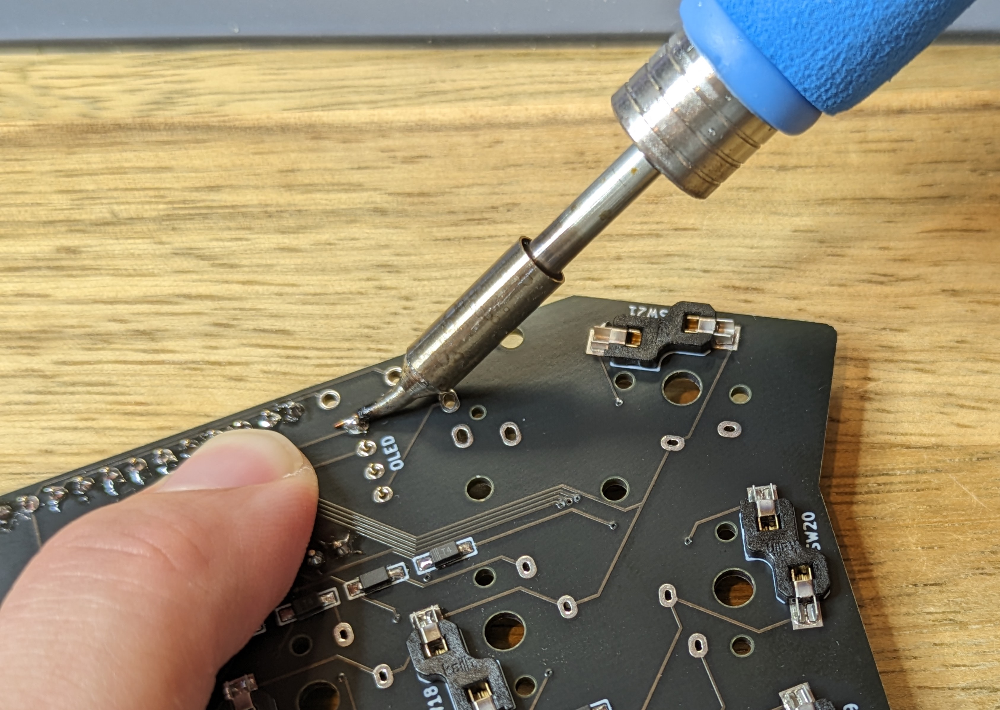

Make sure the sockets are flat:

<Images :paths="[oledsocketsflat, oledsocketsnotflat]" />

Next, we're going to do the headers:

1. Push the 4-pin headers (note the orientation is correct) / Mill-max pins into the OLED sockets.
1. When positioning the OLED on the headers, apply a bit of pressure at the bottom of the OLED to keep it straight. It will not be stable due to the components under the OLED PCB.
1. Add solder to the left and right pins.
1. Ensure the screen is still straight.
1. Finish soldering all pins.

If you're not able to get a good solder connection, remove the screen from the sockets and solder it from the other side:

TODO: add photo.

## Reset Switch, TRRS Jack

Position the reset switch and TRRS jack into their respective locations and solder them. The reset switch is normally held by friction, while the TRRS jack might need to be held with a piece of tape or your finger.

::: details SMD reset
If the PCB uses an SMD reset switch, apply the same method as the diodes: add solder to one pad, grab the switch to it, and solder the other side.
:::

## Pointing Device

### Trackball

See the [dedicated guide](../trackball-module/index.md).

### Trackpoint

## Switches

We're one step away from a functioning keyboard!

This step depends whether hotswap sockets and/or top plates were used.

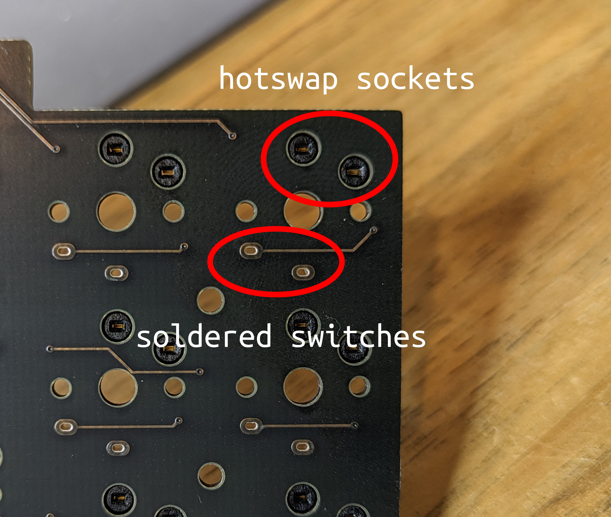

### Top Plates

Top plates can be installed flush against the PCB, or have a small gap. The correct apporach is to have a small gap, but this can be a bit challenging to do.

It makes no practical difference which one is used, but **when 2u stabilizers are installed, the small gap method must be used**.

<Images :paths="[topplatesgap, topplatesflush]" />

Start by pushing a few keys at the edges of the plate, there should be a click once the switch is seated fully in the hole. Make note of the orientation that the switch needs to go into the hole, depending if you have hotswap sockets or plan to solder the switch to the PCB.

::: tip
It is also possible to push all of the switches into the top plate ahead of time. Try that if this method fails.
:::

<Images :paths="[topplates1, topplates2]" />

::: details Installing 2u stabilizers

The stabilizer sits between the PCB and the top plate and needs to be installed before joining the two. First, assemble the stabilizer:

pic

Mount the stabilizer onto the top plate by pushing it from the bottom (the metal bar goes needs to be on the bottom):

<Images :paths="[stabilizersmountedtop, stabilizersmountedbottom]" />

Later on, when installing the keycaps, pay attention to the orientation of the 2u keycap: unlike the other keycaps, it is not symmetric and needs to be installed as follows:

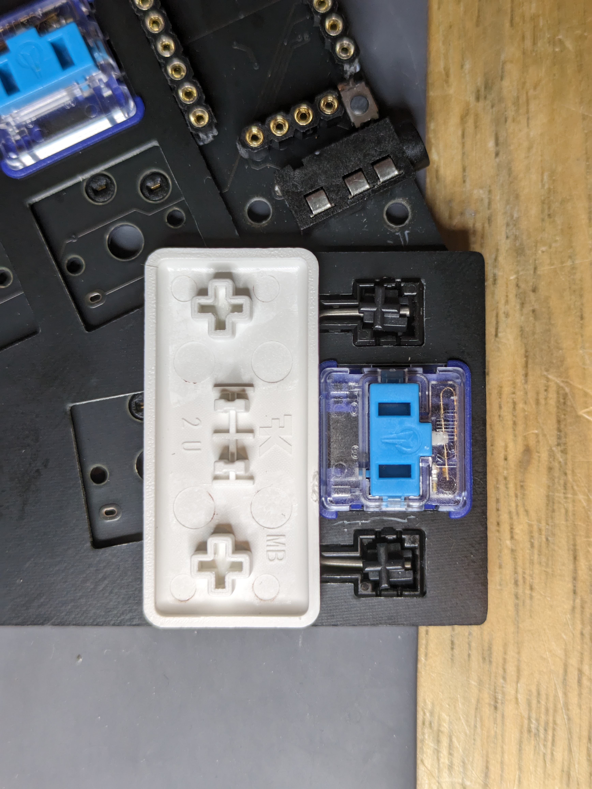

Additional photos showing the rest of the installation:

<Images :paths="[stabilizersinstalled1, stabilizersinstalled2, stabilizersinstalled3, stabilizersinstalled4]" />
:::

Push the top plate against the PCB, pressing the keys pushed before into the sockets or through holes. It should take some amount of force to push the switch all the way, but if it doesn't want to go in then check for alignment of the pins and that none are bent.

::: tip
When pushing switches into hotswap sockets, it is advised to support the socket from the bottom side (either with your finger or a flat surface). Even though they are soldered to the PCB, in very rare occasions the bond between the socket pad and PCB can fail.
:::

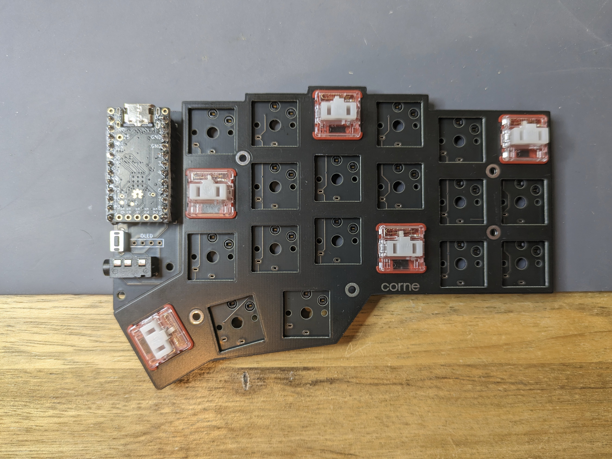

After the top plate is secure against the PCB, push the rest of the switches in. If the top plate is pressed against the PCB in some places, pull it up by inserting tweezers or the end of a switch puller into the gap.

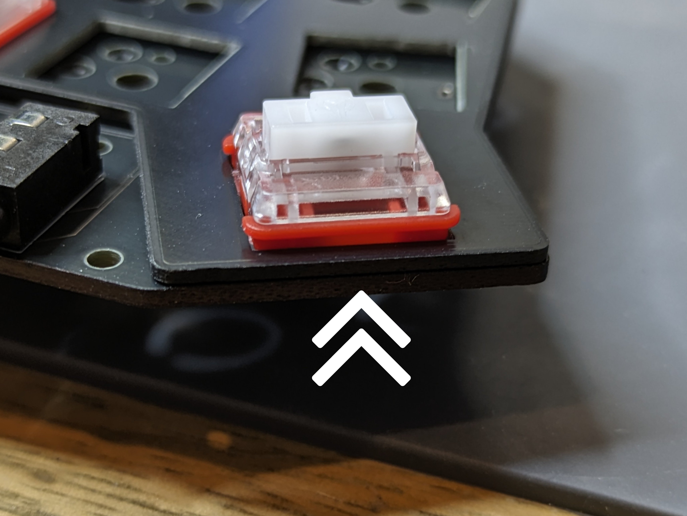

### Soldering

::: info
Skip this step if hotswap sockets were used.
:::

Before soldering, make sure all switches are flush against the PCB and that both of the switch legs are visible. If only one of the legs is seen, the other one is probably bent. Take the switch out and fix it with tweezers or pliers.

::: warning
Take the time to check the alignment of each switch and that both legs are visible. It can be quite time consuming to desolder these after the fact.
:::

<Images :paths="[switchflush, switchnotflush]" />

Finish soldering all of the switches.

## Covers, Cases

Use the hardware that came with the kit to secure any covers and cases.

::: tip
If you're not sure the soldering job you did went well, it is recommended to first flash a firmware and verify all keys are working, before completing this step.
:::

## Finishing Steps

Paint the edge of the PCBs black for the ultimate look and put the keycaps. The build is done, congratulations! :tada:

Head on over to [Firmware](/firmware/) to flash the controllers with QMK.

## Additional Resources

Discord:

- [holykeebs](https://discord.gg/Hd6X7yd5xF).
- [Low Profile Keyboards](https://discord.gg/69UM9sQF8q).
- [QMK](https://discord.gg/Uq7gcHh).

Reddit:

- [/r/olkb](https://old.reddit.com/r/olkb).
- [/r/ErgoMechKeyboards](https://old.reddit.com/r/ErgoMechKeyboards)

Other guides:

- [@KyekOfficial on YouTube](https://www.youtube.com/@KyekOfficial/videos).
- [splitkb](https://docs.splitkb.com/hc/en-us/categories/360002241559-Build-Guides).
- [typeractive](https://docs.typeractive.xyz/).

Lastly, please feel free to improve this guide to help those that follow you (by clicking `Edit this page` below).
