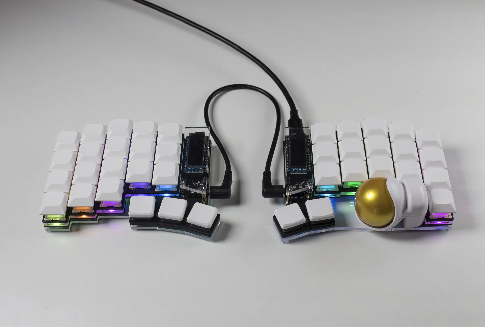
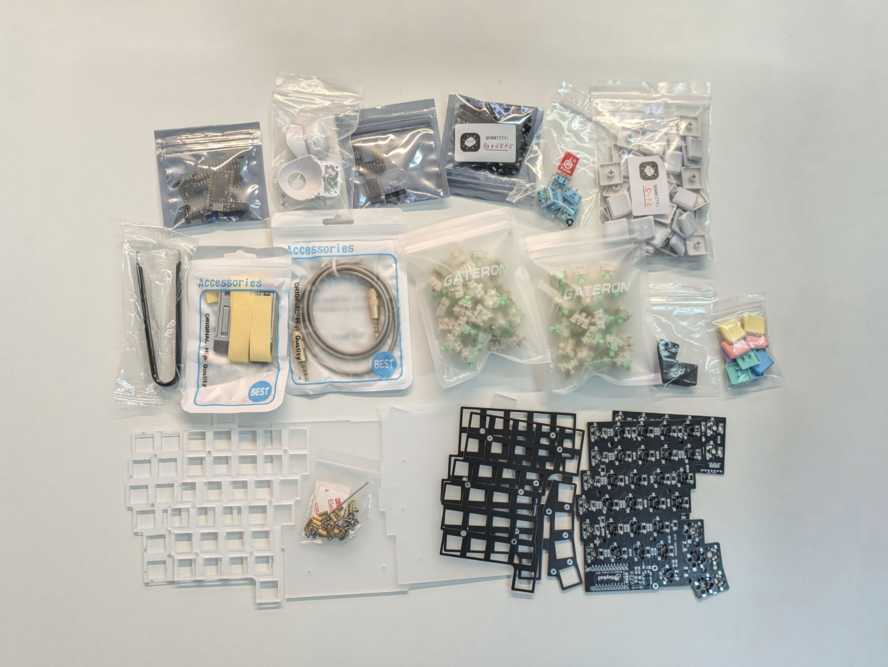

# Keyball

Keyball is a family of keyboards that feature a 34mm thumb trackball with the widely used PMW3360 sensor. In partnership with Yowkees of Shirogane Lab, the creator of this wonderful integrated trackball design, we're happy to bring Keyball to a wider audience.

The trackball sits in an injected molded housing with 3 ceramic bearings. The ball slides snuggly into the housing and moves smoothly in all directions thanks to the bearings.



## Buyer's Guide

Most of the general purpose [Buyer's Guide](../../buyers-guide/index.md) applies to Keyball lineup of keyboards as well, it stands out in a few ways described below.

First, it's worth noting that our Keyball differ from the one sold by Yushakobo / Shirogane Lab. In terms of cosmetics, we use black PCBs, different thickness acrylic plates and different M2 screws. Additionally, we use RP2040 controllers with ample storage so firmware size is not an issue. The rest is identical.

### 34mm Trackball

Keyball uses a 34mm trackball that's not included in your purchase. There are many color options to choose from, and the ones made by [Perixx are a popular choice](https://www.amazon.com/Perixx-PERIPRO-303-GLG-Trackball-Compatible/dp/B07BDHK2MR).

### Thumb Cluster

Keyball has a unique thumb cluster that allows either Kailh's choc low profile or MX switches. Whether you're buying a kit or a prebuilt one, you will get choc hotswap sockets. This option lets you also add choc switches and keycaps to your order.

## Build Guide



Please refer to the canonical Keyball guide below:

- [Keyball39](https://github.com/Yowkees/keyball/blob/main/keyball39/doc/rev1/buildguide_en.md)
- [Keyball44](https://github.com/Yowkees/keyball/blob/main/keyball44/doc/rev1/buildguide_en.md)
- [Keyball61](https://github.com/Yowkees/keyball/blob/main/keyball61/doc/rev1/buildguide_en.md)

Come back to this page when you're at the firmware step, as it differs from the guide above.

For build help that's not specific to Keyball, you're welcome to visit the [Keyboard guide](../index.md) in these docs.

## Firmware

Keyball's firmware is maintained in a dedicated repository by the designer of the keyboard and is written for Pro Micro controllers. A port of the firmware for RP2040 controllers is available in this holykeebs [repository](https://github.com/idank/qmk_firmware/tree/holykeebs-master/keyboards/keyball).

::: danger
Avoid connecting / disconnecting the TRRS cable when the keyboard is powered. This can short the GPIO pins of the controllers.
:::

If you'd like to compile your own firmware, see the [Firmware](../../../firmware/index.md) page on setting up the environment.

Once you have your own clone, while on the `holykeebs-master` branch, flash both sides using (adjust the name to the Keyball you have):

```shell
make keyball/keyball44:via:flash -j8
```

USB cable can be connected to either side of the keyboard. If your trackball doesn't work, try switching the cable to the side with the trackball.

## Custom Keycodes

Keyball comes with custom keycodes that provide access to Keyball features without needing to compile your own firmware. These features are accessible through the following *Special Keycodes* that can be assigned when using [Remap](https://remap-keys.app):

| Keycode    | Value on Remap  | Hex      | Description                                                       |
|:-----------|:----------------|:---------|:------------------------------------------------------------------|
| `KBC_RST`  | `Kb 0`          | `0x7e00` | Reset Keyball configuration                                       |
| `KBC_SAVE` | `Kb 1`          | `0x7e01` | Save Keyball configuration to memory (EEPROM)                     |
| `CPI_I100` | `Kb 2`          | `0x7e02` | Increase pointer speed by 100 CPI (max 12000)                     |
| `CPI_D100` | `Kb 3`          | `0x7e03` | Decrease pointer speed by 100 CPI (min 100)                       |
| `CPI_I1K`  | `Kb 4`          | `0x7e04` | Increase pointer speed by 1000 CPI (max 12000)                    |
| `CPI_D1K`  | `Kb 5`          | `0x7e05` | Decrease pointer speed by 1000 CPI (min 100)                      |
| `SCRL_TO`  | `Kb 6`          | `0x7e06` | Toggle scroll mode                                                |
| `SCRL_MO`  | `Kb 7`          | `0x7e07` | Enable scroll mode (while held)                                   |
| `SCRL_DVI` | `Kb 8`          | `0x7e08` | Decrease scroll speed (max D7 = 1/128)                            |
| `SCRL_DVD` | `Kb 9`          | `0x7e09` | Increase scroll speed (min D0 = 1/1)                              |
| `AML_TO`   | `Kb 10`         | `0x7e0a` | Toggle automatic mouse layer                                      |
| `AML_I50`  | `Kb 11`         | `0x7e0b` | Increase automatic mouse layer timeout by 50ms (max 1000ms)       |
| `AML_D50`  | `Kb 12`         | `0x7e0c` | Decrease automatic mouse layer timeout by 50ms (min 100ms)        |
| `SSNP_VRT` | `Kb 13`         | `0x7e0d` | Lock scroll direction to vertical only                            |
| `SSNP_HOR` | `Kb 14`         | `0x7e0e` | Lock scroll direction to horizontal only                          |
| `SSNP_FRE` | `Kb 15`         | `0x7e0f` | Disable scroll direction lock (free scroll)                       |

If you wish to have your current configuration persist across reboots, use the `KBC_SAVE` keycode to save it to memory. Please note that each half of the Keyball has separate memory, so if you wish to have same behavior regardless of which half is plugged in, you will need to repeat the configuration for each half.

## Building Your Own Firmware

Please see the [Firmware guide](../../../firmware/index.md).
