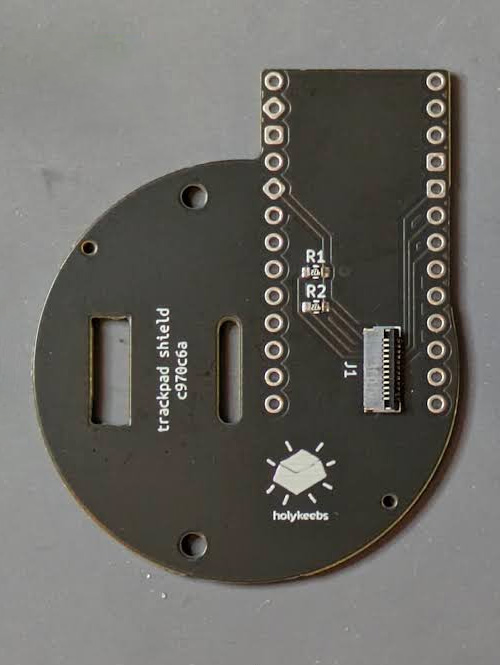
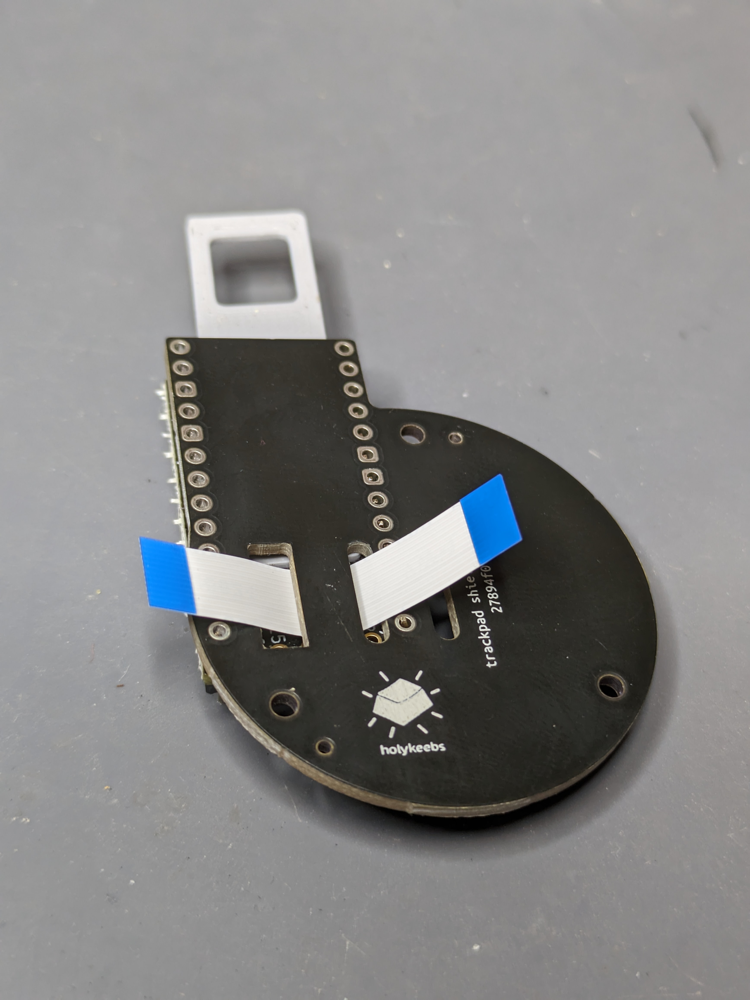
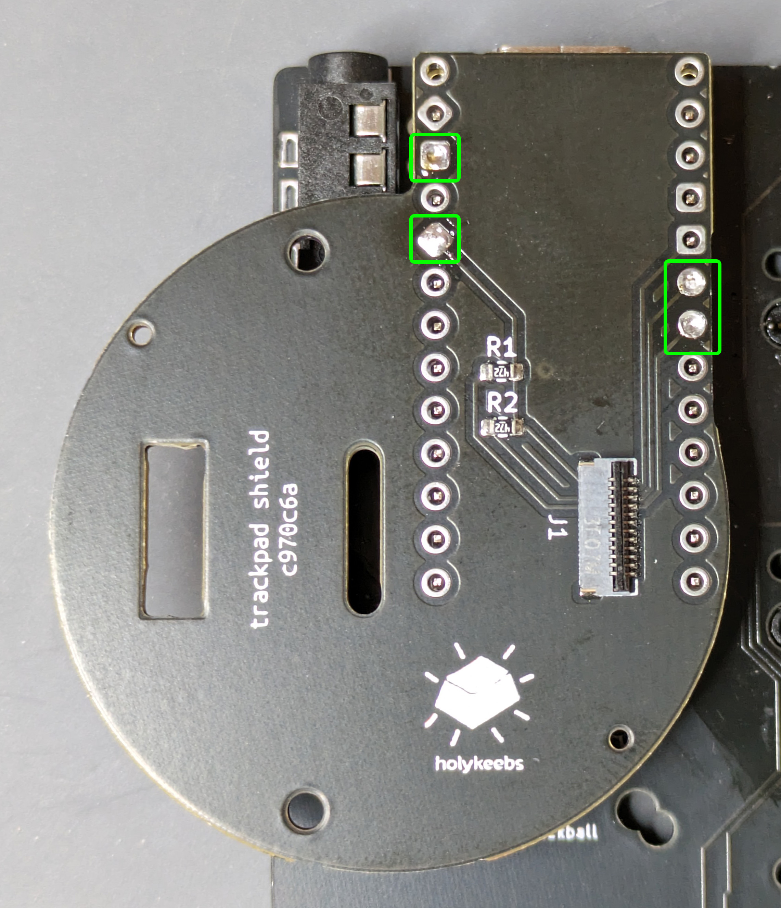
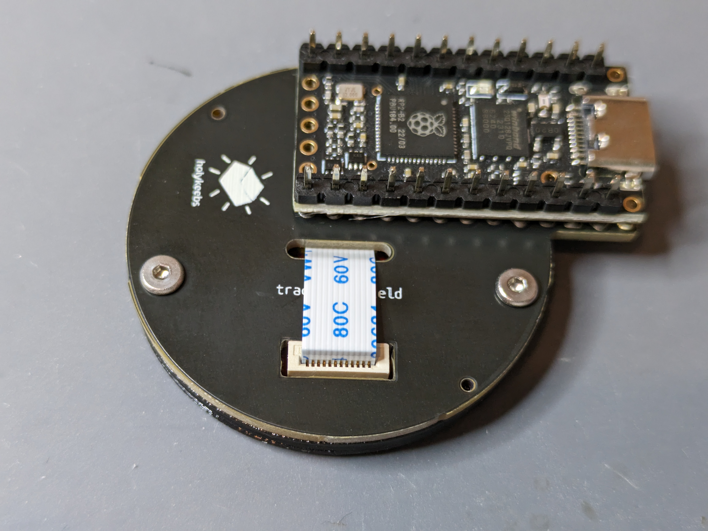

# Touchpad Module

The touchpad module consists of a small adapter PCB (shield) that sits on a top mounted controller, and creates the necessary connections to easily use the Cirque 35mm touchpad.

## Tools

In addition to a soldering iron, you will need an H1.3 M2 hex key.

## Controller

See the [Controllers section](/guides/keyboard/#controllers) in the more general purpose keyboard build guide.

If you have an existing controller, skip this step.

## Module

The module comes with the following parts:

- 35mm touchpad
- adapter PCB (either left or right sided)
- 12-pin, 0.5 pitch FFC cable
- 3d printed mount
- 2 x 4mm M2 screws to fasten the mount to the adapter PCB

First, we solder the adapter PCB to the controller.

### Step 1

The adapter PCB in your kit is specific to the side you want to use the touchpad on. For a right sided touchpad, the top side is the side with the FFC connector:

::: details Left side
On a left sided touchpad, it's recommended to insert the FFC cable before soldering the adapter PCB as it can be a bit difficult after it's soldered on.

:::

Position the PCB on the controller with the 3d printed spacer, check that it sits straight. If you're struggling to get it to sit straight, check if you have blobs of solder on the controller headers. If this is indeed the problem, reflow or remove solder until it sits flush on the spacer.

<Images :paths="[shieldorientation2, shieldorientation1]" />

### Step 2

There are 2 pins to solder on each column. Add a bit of solder to one of the pins on each column while holding it with your finger, locking the PCB in place. Check that it's indeed straight. Finish soldering all 4 but avoid overdoing it resulting in a ball of solder that later interfere with 3d printed mount.

### Step 3

Let's get the soldering part out of the way by getting the touchpad to speak I2C (by default it speaks SPI). Take it out, components side facing you. We need to remove this resistor:

Add a bit of solder to the tip of the iron, and touch both pads of the resistor simultaneously for a few seconds and it should pop out.

Soldering part done! 👏

### Step 4

Connect the FFC cable to the connector on the adapter PCB (note which side of the cable is facing up):

### Step 5

Next, we screw to the 3d printed mount to the adapter PCB. If the controller is mounted on a PCB which doesn't let you access the bottom side of the screw holes, you may need to remove it: **do not take it out by pulling on the adapter PCB**. Use the back side of tweezers and push the underside of the controller from both ends, switching back and forth until it pops out.

The screw holes in the 3d printed piece are small such that screwing into them will hold the screws firmly in place.

<Images :paths="[mountscrewed1, mountscrewed2, mountscrewed3]" />

Finish by pulling the FFC cable through the middle slot.

### Step 6

We're going to secure the touchpad to the mount we just screwed. Push one corner of the touchpad to the notches on the mount as follows, it should sit flush on this corner, with the connector going into the slot on the adapter PCB.

Next, apply pressure on the outside edge of the touchpad to push it into the mount. It's a press fit and should require some force, but not an excessive amount.

### Step 7

Finally, connect the cable to the touchpad connector:

### Step 8

Done! Head over to [Firmware](/firmware/) to flash your controller with touchpad support.

