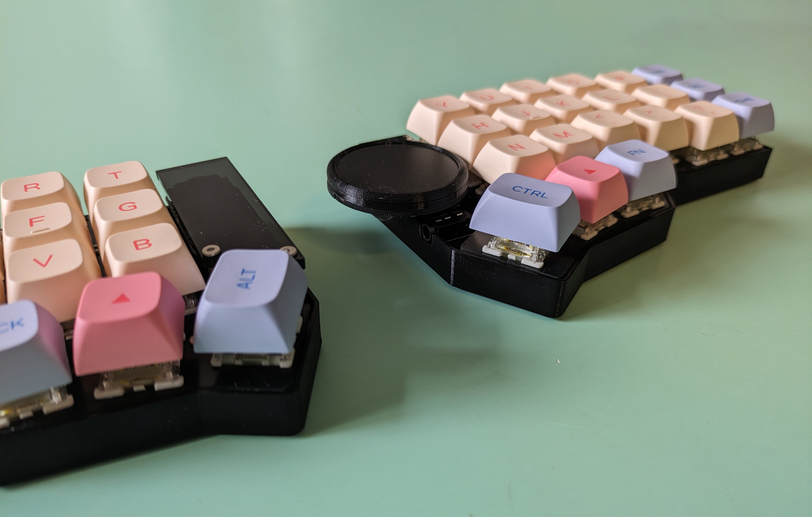
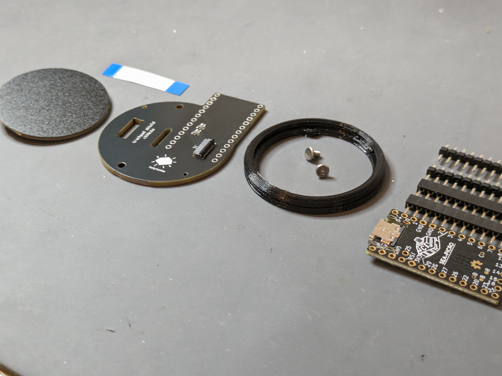
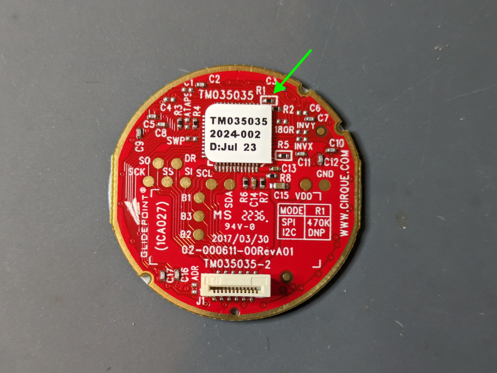

# Touchpad Module

The touchpad module consists of a small adapter PCB (shield) that sits on a top mounted controller, and creates the necessary connections to easily use the Cirque 35mm touchpad.

## Tools

In addition to a soldering iron, you will need an M2 hex key and a bit of super glue.

## Controller

See the [Controllers section](/guides/keyboard/#controllers) in the more general purpose keyboard build guide.

If you have an existing controller, skip this step.

## Module

The module comes with the following parts:

- 35mm touchpad
- adapter PCB (either left or right sided)
- 12-pin, 0.5 pitch FFC cable
- 3d printed mount
- 2 x M2 screws to fasten mount to adapter PCB

First, we solder the adapter PCB to the controller.

### Step 1

The adapter PCB in your kit is specific to the side you want to use the touchpad on. The top side is the side with the FFC connector:

TODO: pcb top side

Position the PCB on the controller, check that it sits straight:

<Images :paths="[shieldorientation1, shieldorientation2, shieldorientation3]" />

::: tip
If you're struggling to get it to sit straight, check if you have blobs of solder on the controller headers. If this is indeed the problem, you can try to remove the solder so it doesn't get in the way, or put a spacer piece between the controller and adapter PCB (if you have a 3d printer, [here's a simple 1mm one](https://github.com/idank/keyboards/blob/main/printed-cases/1mm_spacer.stl) I use, scale Z down/up as necessary).
:::

### Step 2

There are 2 pins to solder on each column, marked with a circle:

Add a bit of solder to one of the pins on each column, locking the PCB in place. Check that it's still straight. Finish soldering all 4 but avoid overdoing it resulting in a ball of solder that later interfere with 3d printed mount.

### Step 3

Let's get the soldering part out of the way by fixing the touchpad to speak I2C (by default it speaks SPI). Take it out, components side facing you. We need to remove this resistor:

Add a bit of solder to the tip of the iron, and touch both pads of the resistor simultaneously for a few seconds and it should pop out.

Soldering part done! 👏

### Step 4

Next, we screw to bottom half of the 3d printed mount to the adapter PCB. If the controller is currently inside sockets which doesn't let you access the bottom side of the screw holes, you may need to remove it: **do not take it out by pulling on the adapter PCB**. Use the back side of tweezers and push the underside of the controller from both ends, switching back and forth until it pops out.

The screw holes in the 3d printed piece are small such that screwing into them will hold the screws firmly in place.

### Step 5

Connect the FFC cable to the connector on the adapter PCB (note which side of the cable is facing up):

::: tip
It's recommended to do a quick test that the touchpad works before moving on. Connect the other end of the cable to the touchpad like so:

Hop over to firmware and flash the controller with touchpad support. Disconnect it after you're done.
:::

Pull the cable through the slot and leave it disconnected for now.

### Step 6

Next, we're going to secure the touchpad to the adapter PCB. Position it on the 3d printed piece that is screwed to the adapter PCB, with the connector going into the slot.

The remaining 3d printed piece has small notches that match the notches on the touchpad. Put the two together and rotate the top piece until there's no gap between the two. Now that you know how to close it up, take some super glue and put a few small dabs on the perimeter of the bottom 3d printed piece, and press the top piece into it.

### Step 7

Done! Head over to [Firmware](/firmware/) to flash your controller with touchpad support.

