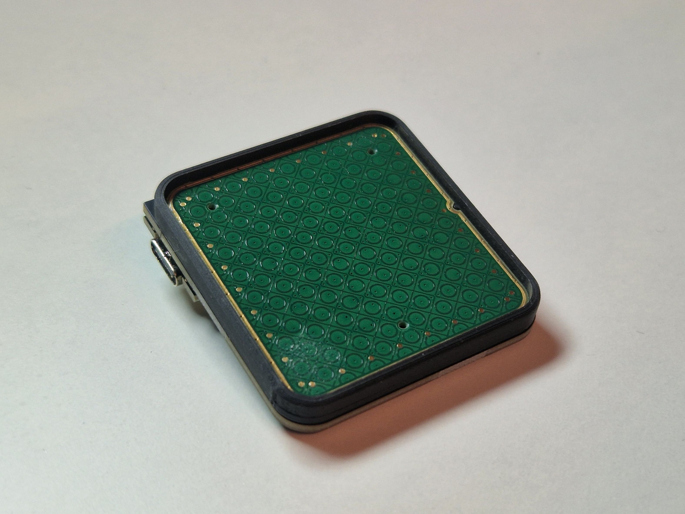

# Touchpad Module

The touchpad module consists of a small adapter PCB (shield) that sits on a top mounted controller, and creates the necessary connections to easily use an Azoteq TPS43 touchpad.

The TPS43 is a 43x40mm touchpad, supporting multitouch and gestures.

::: info

This guide has been updated to a newer, more capable touchpad. For the previous 35/40mm round touchpads, go [here](../touchpad-module-cirque/index.md).

:::

## Tools

In addition to a soldering iron, you will need an H1.3 M2 hex key.

## BOM

|   | description                | qty |
|---|----------------------------|-----|
| 1 | RP2040 controller          | 1   |
| 2 | Custom low profile sockets | 2   |
| 3 | adapter PCB                | 1   |
| 4 | M2x4mm screw, spring washer| 2   |
| 5 | 1mm spacer                 | 1   |
| 6 | TPS43-201A-B               | 1   |
| 7 | 6-pin, 0.5 pitch FFC cable | 1   |
| 8 | 3d printed mount           | 1   |
| 9 | 2mm matte acrylic cover    | 1   |

## Step 1

First, we need a soldered controller to mount the touchpad on. Wether you got one in your kit, or you're bringing your own, solder it. See the [Controllers section](/guides/keyboard/#controllers) in the general keyboard build guide for soldering tips.

## Step 2

The adapter PCB is reversible: for a right sided setup, you should see "top right" on the top side of the adapter PCB (the FFC connectors would be visible as well).

Put the 1mm spacer on your controller, and the adapter PCB on top. This ensures the adapter sits at a consistent distance from the controller. Check that it sits straight: if it's not straight, check if you have blobs of solder on the controller headers. If this is indeed the problem, reflow or remove solder until it sits flush on the spacer.

::: warning

Make sure the through holes on the adapter are correctly lined up with the controller headers!

:::

Proceed by soldering one of the circled holes:

## Step 3

Check for flatness:

Finish soldering all 4, but avoid overdoing it resulting in a ball of solder that later interfere with 3d printed mount.

Pull the spacer out.

## Step 4

Soldering part done! 👏

Next, we're going to fix the touchpad mount to the adapter PCB. The mount has a little notch on one of its internal sides.

For a right sided touchpad, the notch should be on the south side of the adapter PCB. And for a left sided, on the the north side. In the pictures below, we have it on the south side for a right sided setup.

Remove the controller from the sockets, and using the M2 screws and spring washers, screw the two together (only two holes are necessary).

<Images :paths="[covernotch, coverfastened]" />

## Step 5

We're going to fix the touchpad top cover to the touchpad PCB. The cover is a 2mm acrylic piece that's one side matte, one side glossy. The matte side is smooth to the touch and is going to be the surface of the touchpad.

Start by positioning the touchpad inside the mount, aligning the notches:

<Images :paths="[touchpadincover1, touchpadincover2]" />

## Step 6

Remove the protective film off the cover and touchpad, exposing the sticky side of the touchpad.

Press the cover into the mount, matte side up, adhereing it to the touchpad. The cover is a press fit into the mount and should end up flush.

::: danger

Once the cover is on the touchpad, it's basically impossible to separate the two. Make sure it's aligned properly!

:::

<Images :paths="[coverontouchpad1, coverontouchpad2]" />

## Step 7

In this last step, we're going to connect the touchpad to the connector on the adapter PCB. Remove the touchpad (together with the cover) from the mount and open the connector on the touchpad's bottom side by pulling it out.

Push the cable into the connector (with the blue stiffener on top), and close it.

Connect the other side of the cable to the connector on the adapter PCB. It might help to use tweezers or needle nose pliers to push it in.

## Step 8

Push the touchpad back into the mount.

## Step 9

Done! Head over to [Firmware](/firmware/) to flash the controller with touchpad support.

