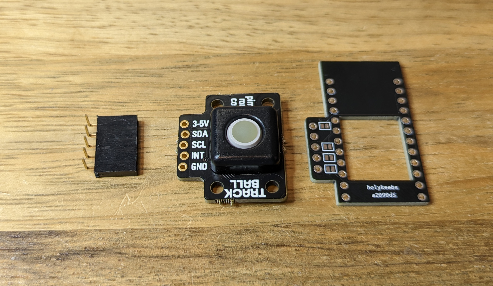
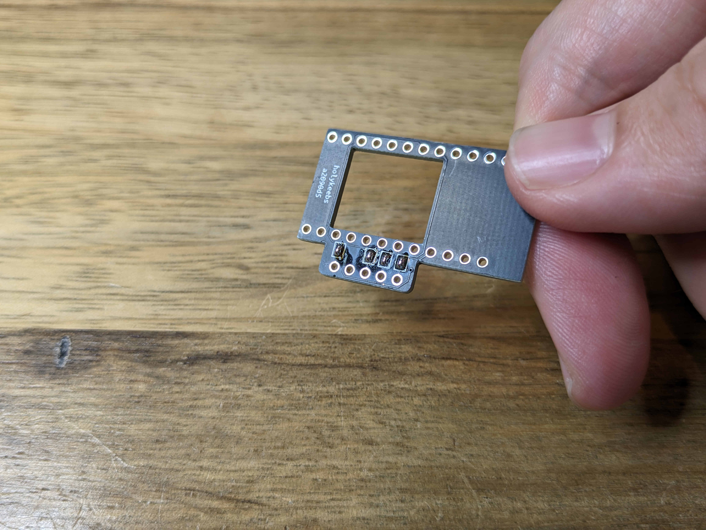
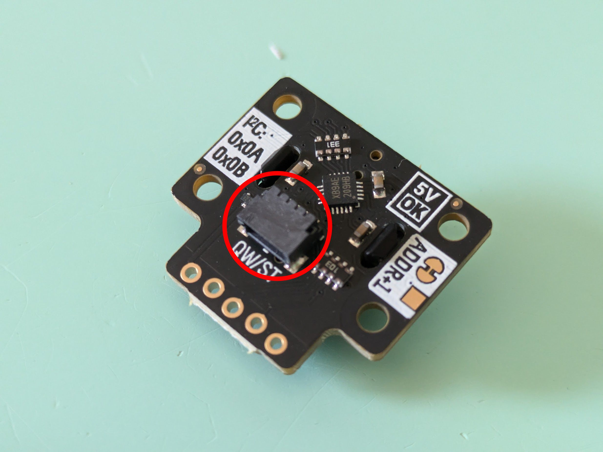
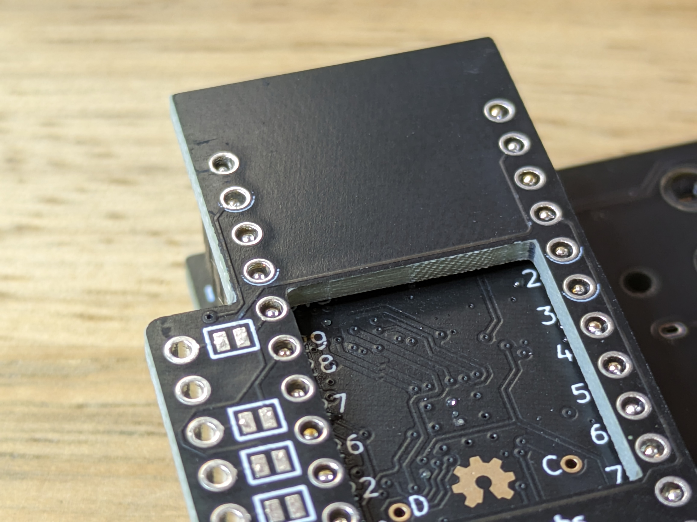
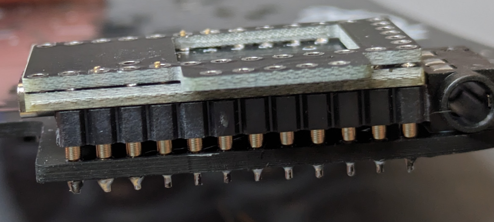
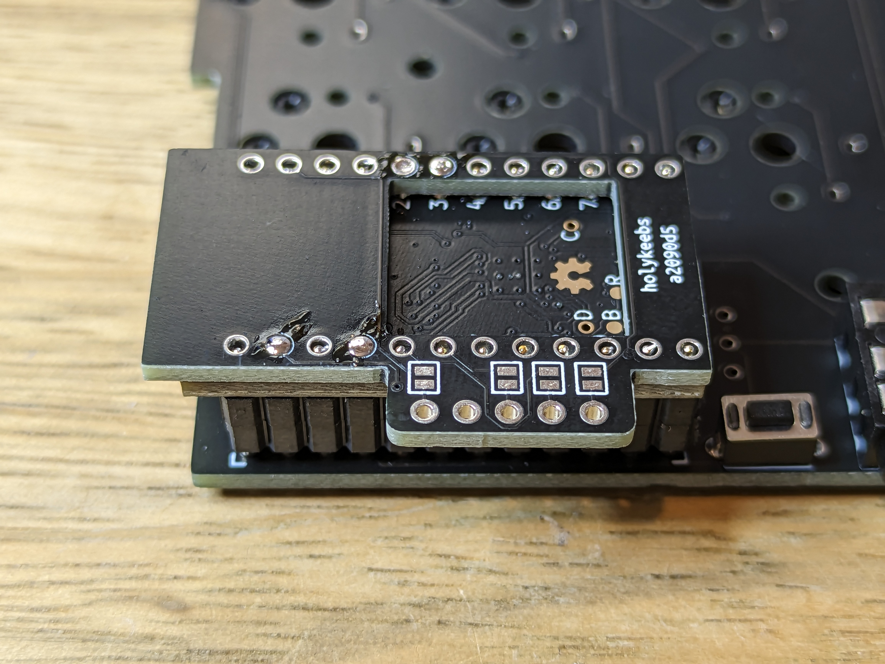

# Trackball Module

The trackball module consists of a small adapter PCB (shield) that sits on a top mounted controller, and creates the necessary connections to easily use a Pimoroni Trackball.

## Tools

In addition to a soldering iron, you will need flush cutters that can cut header pins.

## Controller

See the [Controllers section](/guides/keyboard/#controllers) in the more general purpose keyboard build guide.

If you have an existing controller, skip this step.

## Module

The shield PCB can be used whether the trackball is installed on the left or right side of a split keyboard. The orientation above is the correct one if installed right sided. Since the trackball through-holes protrude on the left side, it needs to be rotated 180 degress if installed left sided, and flip the shield so the protrusion is facing right.

First, we solder the shield to the controller.

### Step 1

With the shield's protrusion positioned correctly, solder the jumpers on the underside:

### Step 2

Position the shield on the controller, check that it sits straight.

<Images :paths="[shieldorientation1, shieldorientation2, shieldorientation3]" />

If your trackball breakout board has this connector:

Use the spacer in your kit and place it between the shield and the controller, this will add the necessary clearance for the connector. It is also possible to remove this connector altogether.

### Step 3

There are 2 pins to solder on each column, marked with a circle.

::: details Using Mill-max pins?
When using Mill-max pins, cut the 4 long pins above the shield, before soldering:

:::

Add a bit of solder to one of the pins on each column, locking the shield in place. Check that it's still straight. Finish soldering all 4 but avoid overdoing it resulting in a ball of solder that would make the trackball not sit flush on the shield.

::: warning
Make sure solder has actually gone through to the controller pins under the shield by holding the iron on the pin for a few seconds. It'll be rather difficult to return to this step after soldering the trackball.
:::

### Step 4

Now, we solder the trackball to the shield. We will use the 90 degree 5 pin strip that came with the trackball to connect the two.

Take the 90 degree 5 pin strip and push it from the underside of the shield. While holding the strip in place with one hand, add a bit of solder to one of the pins from the bottom side of the shield.

<Images :paths="[shieldunder1soldered, shieldunder1solderedtopview]" />

### Step 5

Finish soldering the pins from the underside of the shield. It is best if solder doesn't make it to the other side, so the trackball can be flush against the shield.

<Images :paths="[shieldpinssolderedbottom, shieldpinssolderedtop]" />

### Step 6

Position the trackball on the shield, making sure that it sits straight and flush and solder it.

<Images :paths="[trackballonshield1, trackballonshield2, trackballonshield3]" />

### Step 7

Bend the plastic of the 5 pin strip down, and cut it.

<Images :paths="[shieldpinscut1, shieldpinscut2]" />

### Step 8

Soldering part done! 👏

Head over to [Firmware](/firmware/) to flash your controller with trackball support.
