

# Trackpoint Module

The trackpoint module consists of a small adapter PCB (shield / daughterboard) that sits on a top mounted controller, and creates the necessary connections to easily use a trackpoint, similar to those found in laptops.

::: info HEADS UP
The trackpoint driver and sensor PCBs are thinner and more delicate than the usual PCB you might have dealt with in the past. Additionally, a messy soldering job can cause the sensor to misbehave in a number of ways. Take your time with this build!
:::

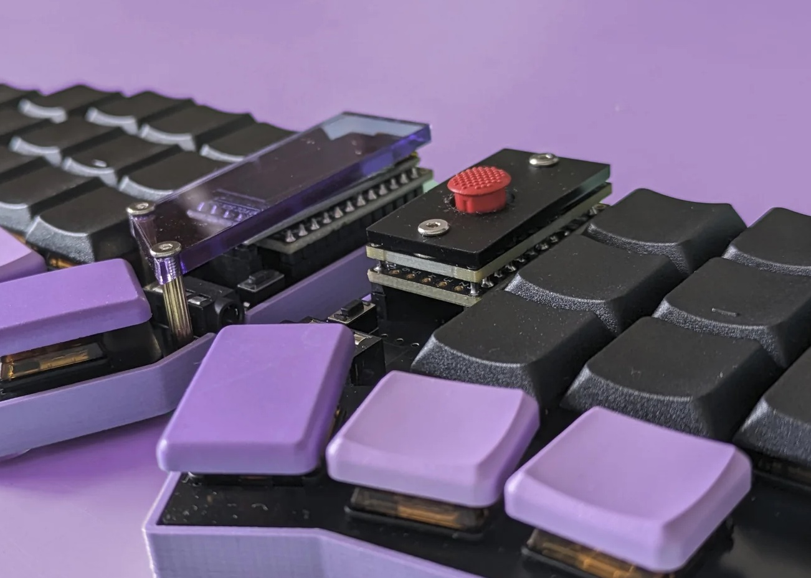

## Tools

In addition to a soldering iron, an H1.3 M2 driver will be needed to install an optional acrylic cover.

## BOM

|   | description                    | qty |
|---|--------------------------------|-----|
| 1 | Sprintek SK8707-01             | 1   |
| 2 | Sockets and precut headers set | 1   |
| 3 | Adapter PCB                    | 1   |
| 4 | Red rubber cap                 | 1   |
| 5 | Acrylic cover\*                | 1   |
| 6 | M2x4mm screw, washer\*         | 2   |
| 7 | RP2040 controller\*            | 1   |

\* optional, depends on chosen configuration.

## Soldering

### Step 1

We will start by soldering the driver and sensor to the adapter PCB.

Our goal is to position the driver on the adapter PCB as follows:

<Images :paths="[driverpcbunsoldered1, driverpcbunsoldered2]" />

::: warning

Pay attention that the top of the driver PCB doesn't cover the through hole as seen below. It needs to be pushed down very slightly so the header pin can pass through.

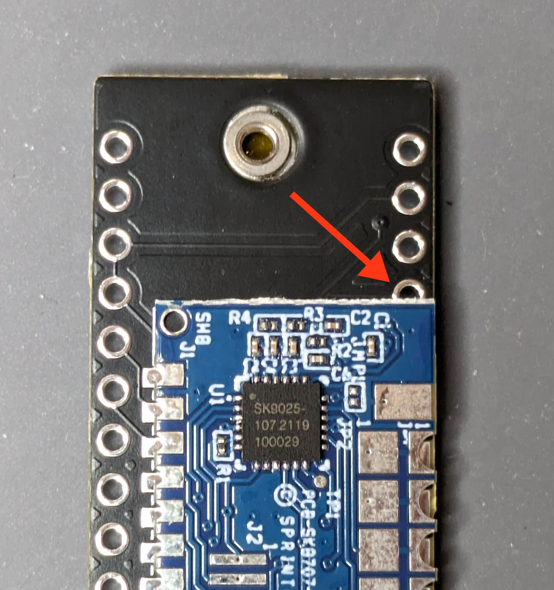

:::

### Step 2

Add a bit of solder to one of the wide pads:

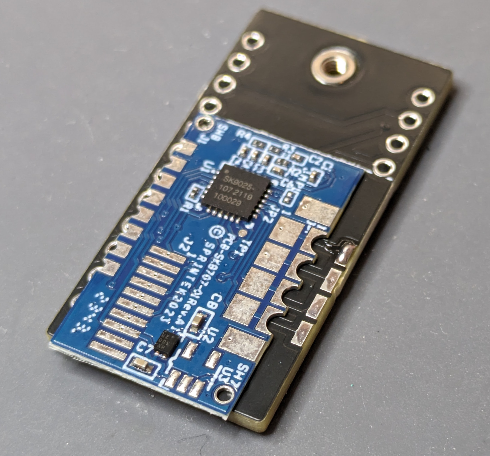

While holding the iron on the pad so the solder is flowing, push the driver into position:

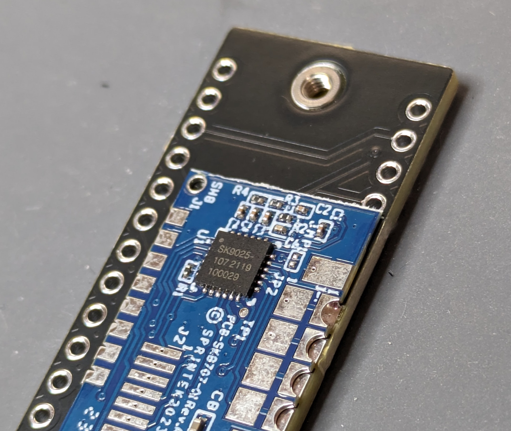

Release the iron, wait a few seconds for the solder to solidify, and then release the driver PCB. Check that it's secure and that the pads all line up with the castellated holes on the driver (it's possible the small pads won't line up exactly due to manufacturing tolerances).

### Step 3

Check that the modified header can pass through:

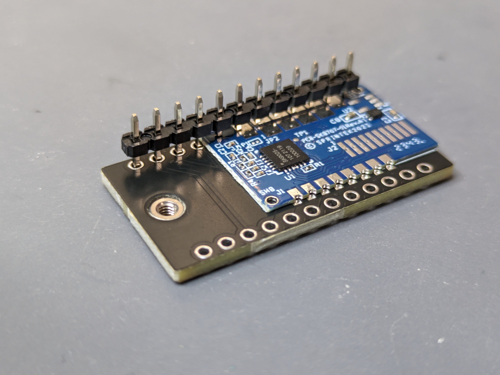

### Step 4

Finish soldering both sides of the driver while ensuring all joints are in fact connected, as it is possible for solder to be present without actually touching the pad or castellated hole.

<Images :paths="[driverpcbsoldered1, driverpcbsoldered2]" />

### Step 5

Similar to the driver, we're going to solder the sensor on the other side of the adapter PCB.

::: info
The two right most holes on the sensor are split, solder both to their corresponding pads.
:::

<Images :paths="[sensorpcb1, sensorpcb2, sensorpcb3]" />

### Step 6

Mechanically secure the 4 mounting holes on the sensor to the adapter PCB. If your adapter PCB has pads under the holes, solder them. Otherwise, you may use a thick super glue:

<Images :paths="[sensorholes1, sensorholes2]" />

### Step 7

We're now ready to work on the controller. Grab the headers that came with the trackpoint kit, one of which will have 8 of its pins cut short (this is done to make room for the driver which sits between the controller and adapter PCBs).

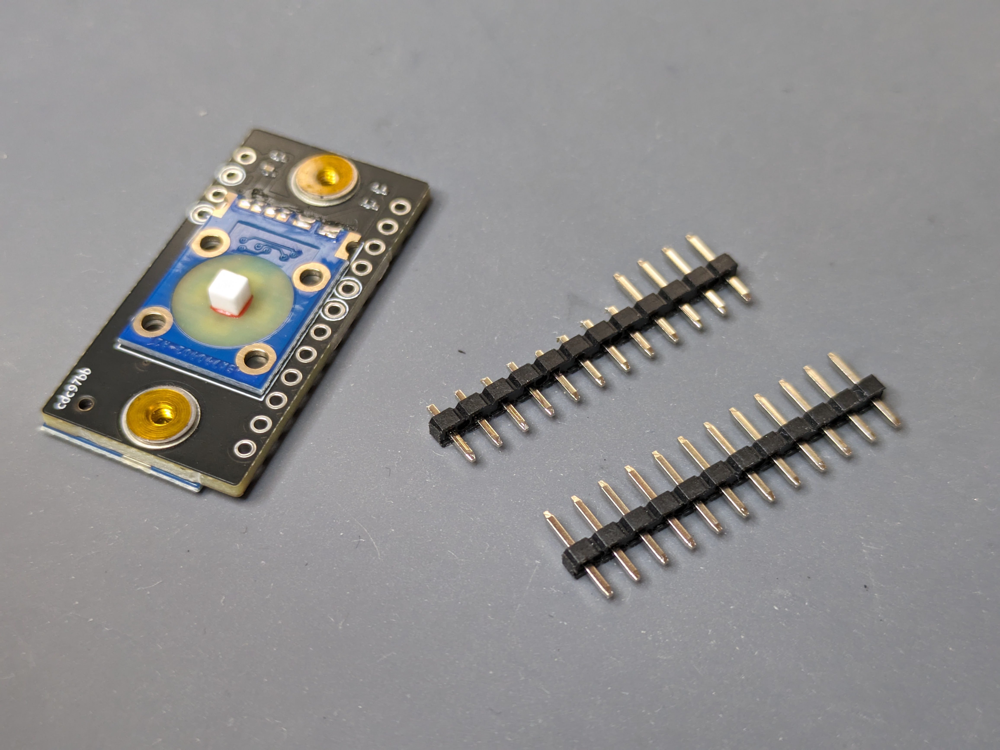

### Step 8

::: warning
Take note that you're soldering the correct pins on the controller: each column should have an unsoldered pin near the USB connector!
:::

The headers should be put as follows:

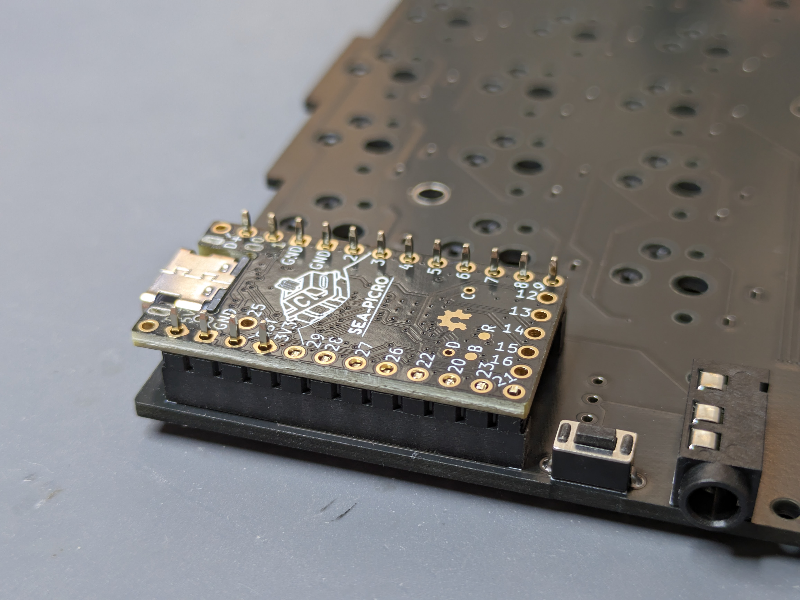

Make sure the controller sits flush on the headers, and solder it.

::: info
Refer to the keyboard build guide for some tips if this is the first controller you're soldering.
:::

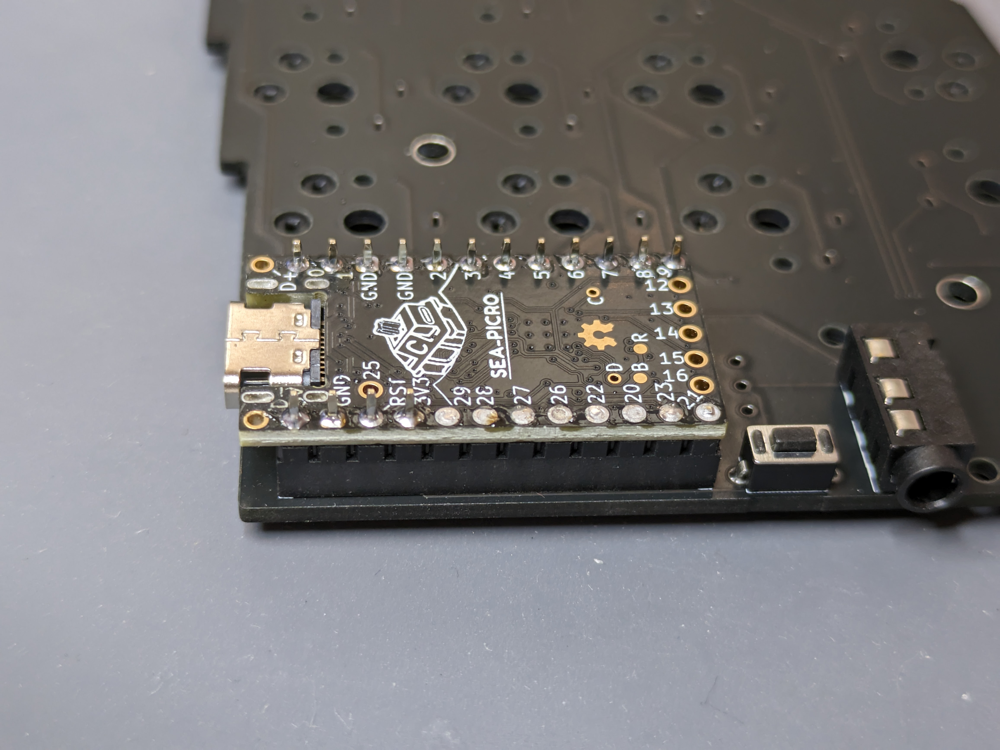

### Step 9

Position the adapter PCB on the soldered controller. Make sure it sits flush:

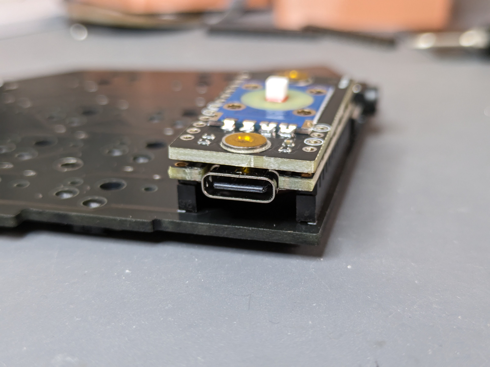

Not flush:

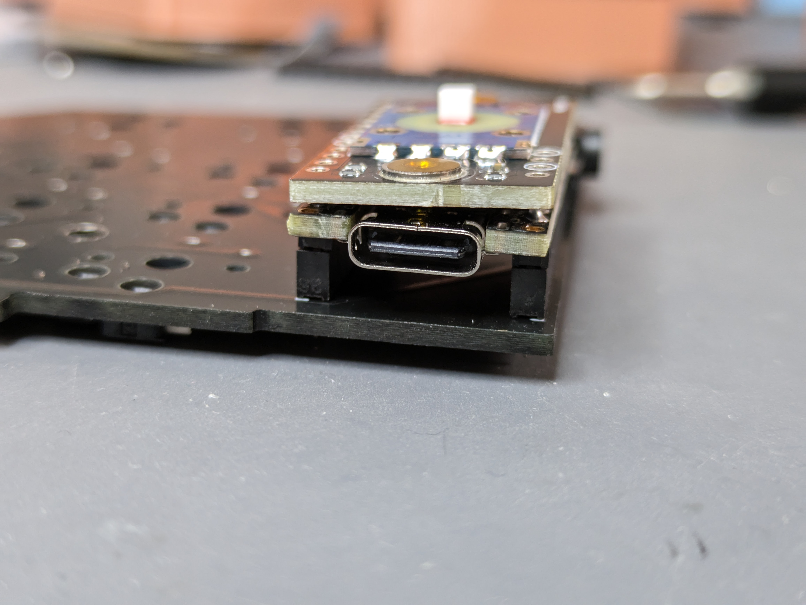

### Step 10

Solder the 4 highlighted pins on the adapter PCB. It's helpful to grab the PCB on the top and bottom sides so it stays straight when doing the first pin.

::: warning
After this soldering it'll become extremely hard to separate the two PCBs. Please make sure everything up to this point was done correctly. If you're worried about something, feel free to stop by Discord to ask. While adding some extra work, it's also possible to solder jumper wires between the two PCBs to test everything works before continuing.
:::

Soldering done! 👏

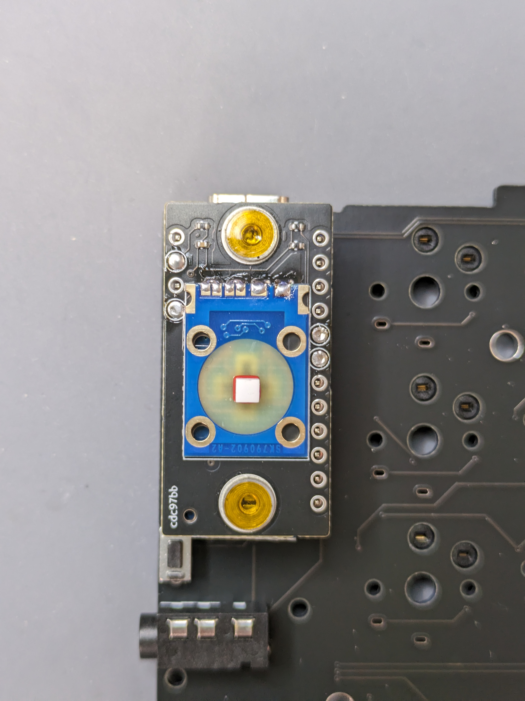

## Assembly

### Step 1

Remove the protective film from the surface mounted nuts and cover. If you don't have one, skip the rest of this step.

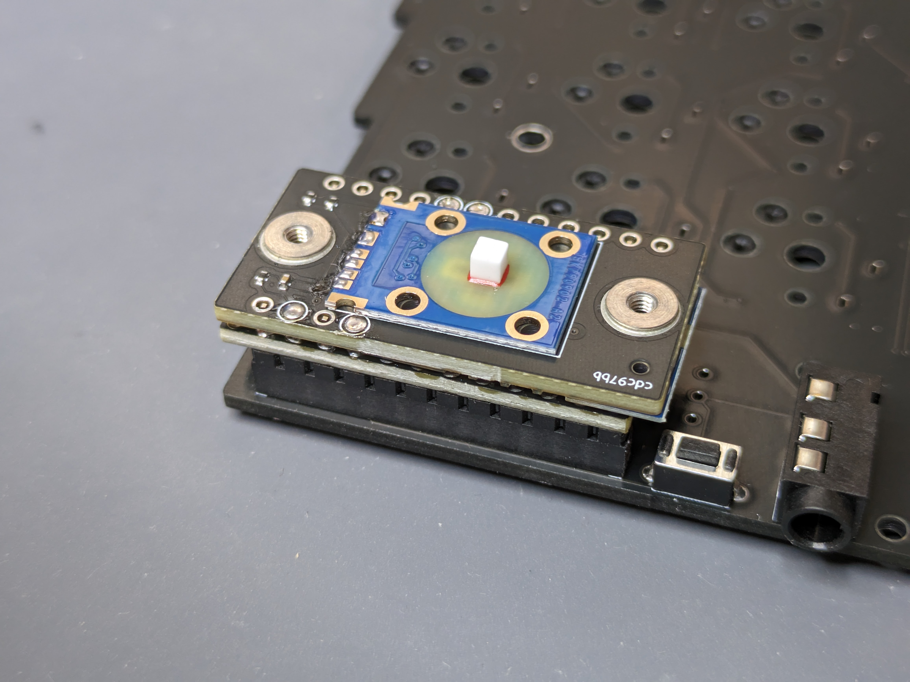

Put a washer on each nut and screw the cover on. The washers support the cover due to the gap the sensor adds, they're not critical but nice to have.

<Images :paths="[washers, washersideview]" />

### Step 2

Put the rubber cap on, and you're done! Head over to [Firmware](/firmware/) to flash your controller with trackpoint support.

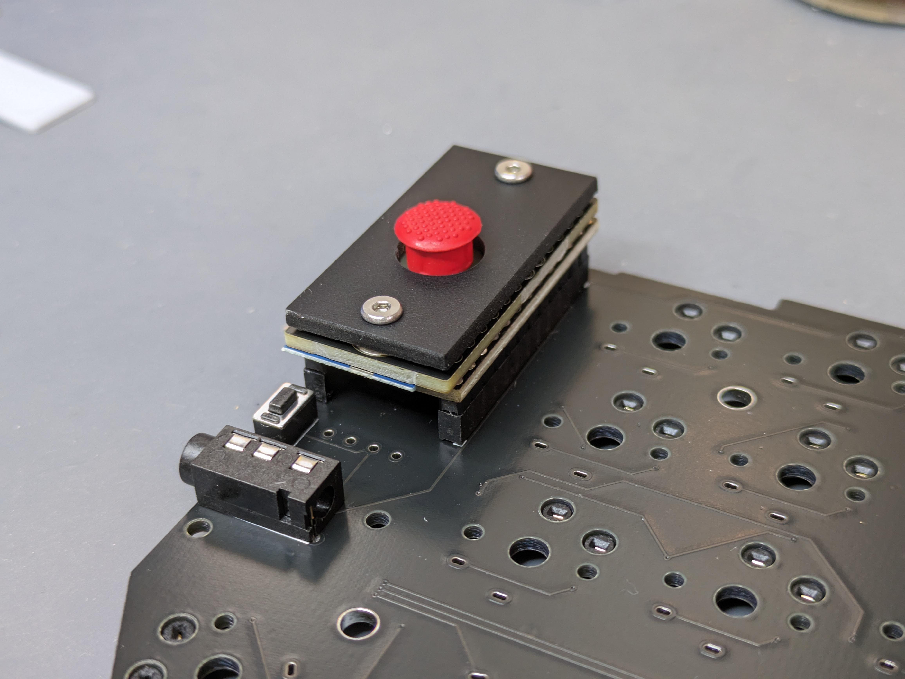
