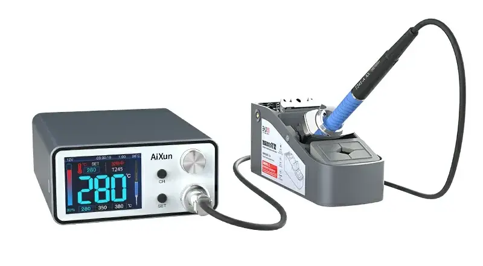
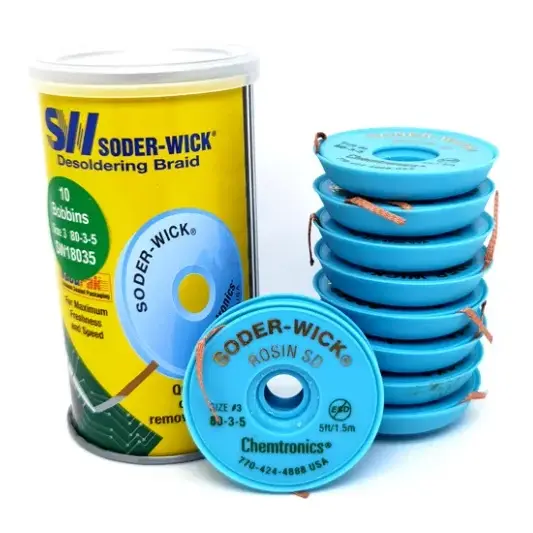
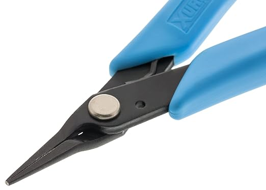
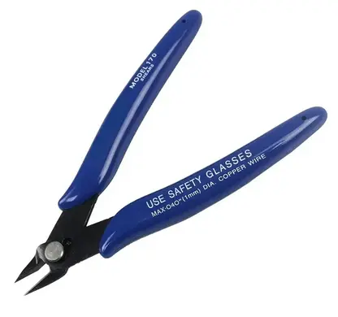

# Recommended Tools

Before you start your keyboard building journey, a few tools are required.

At a minimum you will need the tools listed in the [Keyboard Build Guide](../guides/keyboard/index.md#tools). This page goes into more detail with a few recommendations.

## Soldering Iron

[Pinecil](https://pine64.com/product/pinecil-smart-mini-portable-soldering-iron/) is one of the best budget soldering irons on the market.

If you see yourself doing more soldering in the future and willing to invest >$100, consider the [Aixun T3A](https://www.aliexpress.com/item/1005005833392340.html). Even though it's Chinese, the build quality and materials used are very impressive for the price. Having used Hakko stations for years, I can confidently say that this station is far better in terms of value.

## Desoldering

I find solder wick to be the best common denominator here. A [solder sucker](https://www.aliexpress.com/item/1005005623725652.html) is also a good tool to have, but if you're only getting one, get the wick as it'll work in nearly all situations (0.8 diameter wire is ideal).

## Tweezers

Get one with a pointy, sharp tip and an angled one, they are both useful.

## Needlenose Pliers

[These](https://www.amazon.com/gp/product/B000FOJLEM/) are useful for straightening bent pins.

## Flush Cutters

Used for cutting pins to length. Sharp and thin at the cutting edge is best.

## Screwdriver

Used for screwing cases and covers to the keyboard.

These (knock off?) [Stanley screwdrivers](https://www.aliexpress.com/item/32923367031.html) get the job done (choose H1.3 for the M2 screws that come with our kits). The end might wear out after many uses (can be fixed by sanding it).

If you need a screwdriver set for other things, the [iFixit Mako Driver kit](https://www.amazon.com/iFixit-IF145-299-4-Driver-Bit-64pc/dp/B0189YWOIO) is fantastic.

## Black Marker

A black marker is used to paint the edges of PCBs black for better looks. A sharpie works fine for this, but for best results I recommend an acrylic marker, such as any of [these Posca ones](https://www.amazon.com/dp/B0BKGL69MP), which produces an opaque, matte edge and is easier to use around internal corners due to its soft tip.
