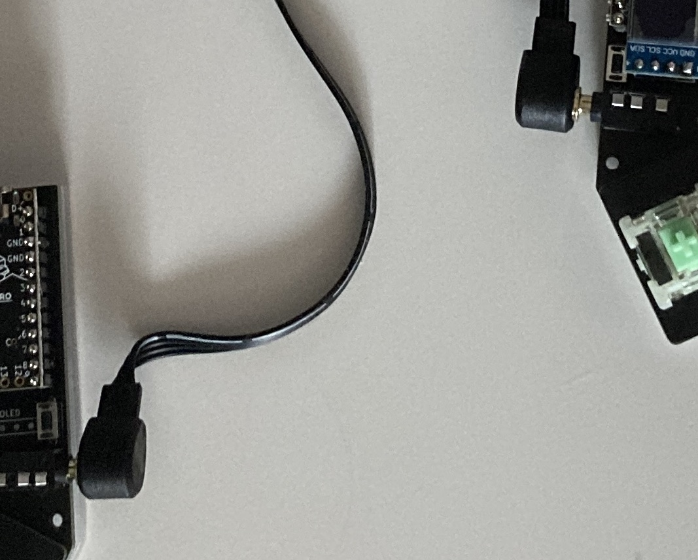
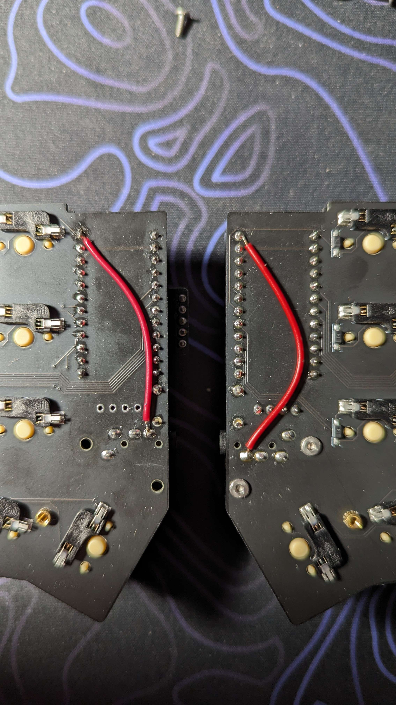
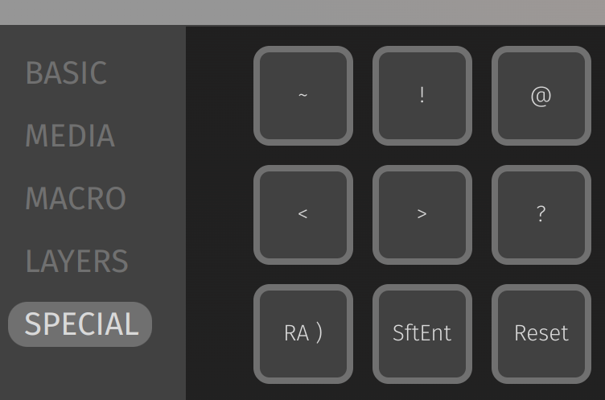

# Troubleshooting

Below you will find some common problems with building a keyboard. Still having trouble? Reach out.

## Keys Not Working

The most common reason for a key not working is a bad solder joint, with diodes sitting at the top.

There is an important distiction to make: when a single key is not working, but the ones around it do work.

### Single Key

We will check that the diode is properly soldered, and that the switch is working.

#### Diode

The diode that this key is wired to could have a bad solder joint, the orientation of the diode could be wrong, or the diode is faulty (less likely).

1. Find the diode closest to the key. If you're not sure which one it is, inspect all of those around it.
1. Look at the diode for bad solder joints and that the orientation is correct. Fix if necessary.

#### Switch

If the diode looks fine and the key is still not responding, then the switch is probably not fully soldered or is improperly inserted into the hotswap socket.

::: tip
We can verify that the problem is with the switch by making a manual electrical connection of the switch. Take tweezers and touch the through-holes or hotswap sockets (choosing the one that is not used on your PCB) of the switch. If the key registers, the mechanical switch is at fault.
:::

1. If hotswaps are used, remove the switch and check for bent legs. Fix with pliers and reinsert.
1. If soldered, check that both through-holes are soldered. It's also possible one of the holes has a bent leg **with** solder, and simply doesn't form a connection. Remove the solder and redo this leg.

### Entire Row, Column

If an entire row or column is unresponsive, one of the controller pins is not fully soldered.

1. Look at the controller sockets from under the PCB. Check they are all fully soldered.
1. Do the same for the top side of the controller.

## OS Doesn't Recognize Keyboard

If your keyboard isn't connected directly to the computer, be it a KVM, USB hub, some form of virtualization, it could be the cause. Try to connect it directly.

## Split Side Is Not Working

If the keyboard is connected with the main side responding, while the peripheral side isn't, it's possible one of the controllers is faulty. The most common cause is hot-plugging the TRRS cable (i.e. connecting/disconnecting it while the the keyboard is powered), which can cause shorts at the controller GPIO pins (we specifically call this out when you open packages from us).

First, make sure you've pushed the TRRS cable into the connectors all the way through. Here's a cable that's not pushed all the way:



Fix this by disconnecting the USB cable and pushing both sides of the TRRS cable all the way into the connector.

If this doesn't fix the problem, try these:

1. Verify solder joints of the TRRS jacks and the controller sockets are good.
1. Check the controller on the peripheral is getting power, its LED should be on. If it's not, recheck the solder joints and try a different TRRS cable (power off first).
1. Power each side separately (disconnect the keyboard and the halves).
1. Try swapping the controllers between the sides.
1. If each side works separately but split still doesn't, something was shorted.

If the conclusion is that a short is the culprit, it's possible to manually solder a different pin on the controller that connects to the TRRS jack data pin, thereby replacing the shorted pin:



This connects GP0 instead of the shorted GP1 to the TRRS jack on each side. Lastly, edit the `users/idank/config.h` file in your QMK clone to have this instead:

```
// Old before shorted pin.
// #define SERIAL_USART_TX_PIN GP1
#define SERIAL_USART_TX_PIN GP0
```

Flash both sides and try again.

## Trackball Is Skipping

This happens on split keyboards when only the master side is connected. Unpower it, connect the halves, and try again.

## Reset Button Doesn't Go Into Bootloader

In VIA (or Remap), try binding a key to Reset (QK_BOOT keycode) and pressing it:


